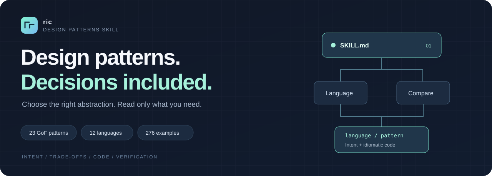
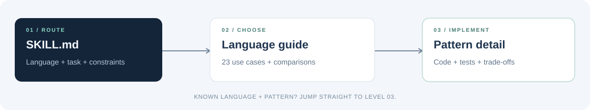

<p align="center">
  
</p>

<h1 align="center">ric-design-patterns-skill</h1>
<p align="center"><strong>让模式服务于设计，而不是让设计迁就模式。</strong></p>
<p align="center">GoF 23 · 12 languages · 276 examples · Progressive disclosure</p>
<p align="center">
  <a href="SKILL.md">Skill 入口</a> ·
  <a href="references/typescript/README.md">开始选型</a> ·
  <a href="docs/VERIFICATION.md">验证记录</a> ·
  <a href="docs/SOURCES.md">研究来源</a>
</p>

---

**不只是模式目录，而是一份面向工程决策的 Agent Skill。** 从“哪里会变化”开始，按语言比较候选，再查看可运行实现、适用边界和容易踩的坑。无需把整本模式教材塞进上下文。

| 先选对 | 再写对 | 能核验 |
|---|---|---|
| 每种语言都有 23 项场景与横向对比 | 每个模式都有完整源码、角色映射与运行命令 | 来源分层、源码哈希、编译/运行记录 |
| 总是比较“不用模式”的简单方案 | 不把 Java 类层次硬搬到 Go / Rust | 已验证与待验证明确区分 |

## 三层导航，只读需要的内容



`SKILL.md` → `references/<language>/README.md` → `references/<language>/<pattern>.md`

已知语言和模式时直接跳转到详情。每个详情自包含：**意图 / 适用与避免 / 结构与角色 / 完整示例 / 代价 / 测试 / 替代方案**。

## 语言入口

[Java](references/java/README.md) · [C#](references/csharp/README.md) · [C++](references/cpp/README.md) · [Go](references/go/README.md) · [Rust](references/rust/README.md) · [Python](references/python/README.md) · [TypeScript](references/typescript/README.md) · [JavaScript](references/javascript/README.md) · [PHP](references/php/README.md) · [Ruby](references/ruby/README.md) · [Swift](references/swift/README.md) · [Kotlin](references/kotlin/README.md)

**覆盖：** 创建型 5 · 结构型 7 · 行为型 11。参考站的 22 项目录之外，单独补充解释器；JavaScript、Kotlin 为附加语言。范围是 **GoF 23**，不是所有架构、并发与分布式模式的全集。

## 开始使用

```sh
git clone https://github.com/lichong-a/ric-design-patterns-skill.git
```

将整个 `ric-design-patterns-skill` 目录放入你的 Agent Skills 宿主所指定的技能目录，入口为 `SKILL.md`；不同宿主的安装路径/启用方式不同，不只复制入口文件。纯阅读与选型无需安装 12 套工具链，运行某个示例时只需对应语言环境。

把真实约束交给 Agent，而不是只说一个模式名：

> 使用 ric-design-patterns-skill。我的 TypeScript 价格规则需要运行时替换，订单状态又会随事件变化。比较策略、状态和模板方法，先给最简单方案，再给实现与测试。

也可以直接定位：

```sh
python3 scripts/lookup.py --language rust --query "策略"
python3 scripts/run_examples.py --languages python --require-runtimes
```

## 看一眼，再决定是否深入

| 你的问题 | 建议从这里开始 |
|---|---|
| 创建扩展点、产品族与分步构建怎么选？ | [Java 选择指南](references/java/README.md) |
| 回调能否代替一套策略类？ | [TypeScript · 策略](references/typescript/strategy.md) |
| 无继承语言怎样表达稳定流程的创建扩展点？ | [Go · 工厂方法](references/go/factory-method.md) |
| Clone 究竟复制数据还是共享引用？ | [Rust · 原型](references/rust/prototype.md) |
| 包装对象是在加行为，还是控制访问？ | [Python · 装饰](references/python/decorator.md) / [代理](references/python/proxy.md) |

## 质量与边界

当前匹配源码哈希的编译/运行记录：**276/276 通过**。具体版本、未执行项与方法见 [验证记录](docs/VERIFICATION.md)，不是生产就绪或跨平台认证。

示例不搬用上游代码与配图；JavaScript 是本项目 TypeScript 的同源去类型版本。默认教学范围为同步、内存内行为，不自动获得事务、持久化、线程安全或安全沙箱。73 个登记来源与抽样边界见 [来源说明](docs/SOURCES.md)。

<details>
<summary><strong>维护与复现</strong></summary>

```sh
python3 scripts/build.py
python3 scripts/validate.py
python3 scripts/run_examples.py --languages python --require-runtimes
python3 scripts/build.py
python3 scripts/package.py
```

规范源在 `data/`，页面与独立源码由 `scripts/build.py` 生成；改代码后会以哈希使旧测试记录失效。完整流程见 [贡献指南](CONTRIBUTING.md)。

</details>

---

[信息架构](docs/ARCHITECTURE.md) · [变更记录](docs/CHANGELOG.md) · [贡献指南](CONTRIBUTING.md) · [内容与许可](NOTICE.md)

<sub>为清晰的变化点建立边界，而不是为模式的名字增加类。</sub>
