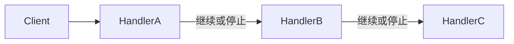

# C++ · 责任链（Chain of Responsibility）

[← C++ 选择指南](README.md) · [Skill 入口](../../SKILL.md) · [可运行源码](../../examples/cpp/chain-of-responsibility/main.cpp)

**分类：行为型** · **代码目标：C++17**

> 让请求沿一组处理者传递，由每个处理者决定处理、继续或拒绝。

模式意图基于参考站概念页归纳；工程取舍与示例为本项目新编。 [概念依据](https://refactoringguru.cn/design-patterns/chain-of-responsibility) · [来源边界](../../docs/SOURCES.md)

## 问题与动机

请求需按顺序进行若干校验；把规则写死在一个大函数里很难重新组合与独立验证。

**本例场景：** 以可组合规则验证整数必须为正且低于上限，失败立即短路。

## 适用与避免

**适用：** 处理顺序可配置，并且停止条件、默认结果与传递语义明确。

**避免：** 必须执行的步骤不允许跳过，却使用可能无人处理的隐式链。

## 结构、参与者与协作

下图是角色关系示意，不是要求每种语言建立相同类层次。动态语言的协议角色可由方法约定承担。



| GoF 角色 | 本例对应职责（成员拼写以代码为准） |
|---|---|
| Handler | Rule：检查当前请求并委派给 next |
| ConcreteHandler | 不同谓词规则或专用处理者 |
| Client | 构建链并提交教学整数请求 |

1. 约定处理者的结果模型：处理完成、继续还是失败。
2. 以固定或可配置顺序组装链，禁止成环。
3. 让未处理请求得到显式结果，不默默丢弃。

## C++ 实现要点

std::function 封装处理规则，unique_ptr 拥有后继，&& 保持短路。此处是逐项验证的职责链变体，不是所有处理者都必然被调用的广播。

**实现定位：** 可运行的最小教学实现；语言机制与模式意图分别说明。

## 完整示例

以下代码与独立源码文件逐字同步；无需第三方业务依赖。测试只覆盖代码中实际写出的断言。

```cpp
#include <algorithm>
#include <functional>
#include <iostream>
#include <map>
#include <memory>
#include <stdexcept>
#include <string>
#include <utility>
#include <vector>
using std::string;
void check(bool value) { if (!value) throw std::runtime_error("check failed"); }
template<class F> void expect_error(F action) {
    bool failed = false;
    try { action(); } catch (const std::logic_error&) { failed = true; }
    check(failed);
}

class Rule {
    std::function<bool(int)> accepts;
    std::unique_ptr<Rule> next;
public:
    Rule(std::function<bool(int)> f, std::unique_ptr<Rule> n = nullptr): accepts(std::move(f)), next(std::move(n)) {}
    bool handle(int value) const { return accepts(value) && (!next || next->handle(value)); }
};

int main() {
    int visits = 0;
    Rule chain{[](int n){ return n > 0; }, std::make_unique<Rule>([&](int n){ ++visits; return n < 10; })};
    check(!chain.handle(-1) && visits == 0);
    check(chain.handle(5) && visits == 1);
    check(!chain.handle(12) && visits == 2);
    std::cout << "OK chain-of-responsibility\n";
}
```

## 运行与验证

从仓库根目录执行（先安装对应工具链）：

```sh
cd examples/cpp/chain-of-responsibility
g++ -std=c++17 -Wall -Wextra -pedantic main.cpp -o demo
./demo
```

期望标准输出：`OK chain-of-responsibility`。任何内嵌断言失败都应导致非零退出；Python 不要使用 `-O` 禁用断言，Swift 不要使用 `-Ounchecked`。

**当前源码状态：已通过编译/运行与内嵌断言。** [完整验证记录](../../docs/VERIFICATION.md)。源码 SHA-256：`f8a704f592de7770ca7121d93dbbda2fdb266a444013da9242d26bb9f0b1c87d`。

## 收益与代价

**收益**

- 发送者与具体处理者解耦。
- 处理步骤可复用、重新排序和单独测试。

**代价**

- 顺序会影响结果，调试需要知道经过哪些节点。
- 传统责任链不保证必有处理者；本例采用短路校验链变体。

## 工程边界与常见错误

生产中记录规则标识与短路原因。安全校验链的顺序不能随意让用户重排；异步中间件还需约定 next 是否只能调用一次。

- 每个节点都无条件执行，仍声称具备短路语义。
- 重复调用 next 或形成循环。
- 拒绝后仍执行后面的副作用。

上述工程要求不是运行一次教学示例便能证明的能力；未特别实现的并发访问、外部 I/O、事务、重试与持久化不在本例保证内。

## 扩展测试建议（不等于已全部实现）

- 合法请求经过所有要求的规则。
- 首条失败规则立即停止。
- 终端成功/无人处理语义明确。

针对你的真实输入补充边界/错误用例，再检查替换实现是否保持契约。必要时加入并发竞争、生命周期释放、深度/内存上限和回归测试；不要把断言通过当成生产就绪认证。

## 与替代模式比较

**[命令](command.md)：** 命令封装一次操作；责任链决定请求经过哪些处理者。

**[装饰](decorator.md)：** 装饰常围绕一次调用叠加行为；链明确控制向后传递与停止。

## 来源与继续阅读

- [模式概念](https://refactoringguru.cn/design-patterns/chain-of-responsibility)
- [C++ Core Guidelines：RAII/所有权](https://isocpp.github.io/CppCoreGuidelines/CppCoreGuidelines#Rr-raii)
- [C++ 工作草案：块作用域声明](https://eel.is/c++draft/stmt.dcl)
- [来源分层、原创范围与未覆盖项](../../docs/SOURCES.md)
