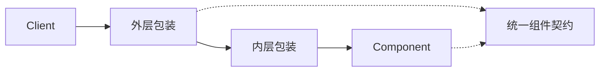

# C++ · 装饰（Decorator）

[← C++ 选择指南](README.md) · [Skill 入口](../../SKILL.md) · [可运行源码](../../examples/cpp/decorator/main.cpp)

**分类：结构型** · **代码目标：C++17**

> 在保持共同契约的前提下，通过可嵌套包装为单个对象叠加行为。

模式意图基于参考站概念页归纳；工程取舍与示例为本项目新编。 [概念依据](https://refactoringguru.cn/design-patterns/decorator) · [来源边界](../../docs/SOURCES.md)

## 问题与动机

文本输出需要按组合增加前缀与括号；为每个组合建立子类不利于扩展。

**本例场景：** 用前缀和括号包装文本，显式展示不同包装顺序。

## 适用与避免

**适用：** 功能要在运行时按需叠加，包装与被包装对象具有可替换的契约。

**避免：** 只是一次简单函数变换，或包装后已经改变了原接口语义。

## 结构、参与者与协作

下图是角色关系示意，不是要求每种语言建立相同类层次。动态语言的协议角色可由方法约定承担。



| GoF 角色 | 本例对应职责（成员拼写以代码为准） |
|---|---|
| Component | Text：render 操作 |
| ConcreteComponent | PlainText：原始文本 |
| Decorator | PrefixText / BracketText：保存并委派给另一个 Text |

1. 保持组件接口足够小。
2. 包装器接收同一接口对象，并在委派前后加行为。
3. 在组合根显式决定包装顺序，测试顺序敏感的输出。

## C++ 实现要点

移动 unique_ptr 形成可堆叠的单所有者包装链；virtual 析构确保从组件接口正确释放整个链。包装顺序由测试显式固定。

**实现定位：** 可运行的最小教学实现；语言机制与模式意图分别说明。

## 完整示例

以下代码与独立源码文件逐字同步；无需第三方业务依赖。测试只覆盖代码中实际写出的断言。

```cpp
#include <algorithm>
#include <functional>
#include <iostream>
#include <map>
#include <memory>
#include <stdexcept>
#include <string>
#include <utility>
#include <vector>
using std::string;
void check(bool value) { if (!value) throw std::runtime_error("check failed"); }
template<class F> void expect_error(F action) {
    bool failed = false;
    try { action(); } catch (const std::logic_error&) { failed = true; }
    check(failed);
}

struct Text { virtual ~Text() = default; virtual string render() const = 0; };
struct PlainText final : Text { string render() const override { return "hi"; } };
struct PrefixText final : Text {
    std::unique_ptr<Text> inner;
    explicit PrefixText(std::unique_ptr<Text> t): inner(std::move(t)) { if (!inner) throw std::invalid_argument("inner"); }
    string render() const override { return "!" + inner->render(); }
};
struct BracketText final : Text {
    std::unique_ptr<Text> inner;
    explicit BracketText(std::unique_ptr<Text> t): inner(std::move(t)) { if (!inner) throw std::invalid_argument("inner"); }
    string render() const override { return "[" + inner->render() + "]"; }
};

int main() {
    BracketText a{std::make_unique<PrefixText>(std::make_unique<PlainText>())};
    PrefixText b{std::make_unique<BracketText>(std::make_unique<PlainText>())};
    check(a.render() == "[!hi]"); check(b.render() == "![hi]");
    std::cout << "OK decorator\n";
}
```

## 运行与验证

从仓库根目录执行（先安装对应工具链）：

```sh
cd examples/cpp/decorator
g++ -std=c++17 -Wall -Wextra -pedantic main.cpp -o demo
./demo
```

期望标准输出：`OK decorator`。任何内嵌断言失败都应导致非零退出；Python 不要使用 `-O` 禁用断言，Swift 不要使用 `-Ounchecked`。

**当前源码状态：已通过编译/运行与内嵌断言。** [完整验证记录](../../docs/VERIFICATION.md)。源码 SHA-256：`d8f072684645c4f34c52dba390e7054879b1718041dfe2e804671356e42c044c`。

## 收益与代价

**收益**

- 组合功能而不是枚举所有继承组合。
- 可对单个对象添加责任，不改变其同类实例。

**代价**

- 包装层多时调试路径较长。
- 顺序、对象身份、资源关闭和错误传播更难追踪。

## 工程边界与常见错误

文件或网络装饰链必须定义关闭/取消向内传播的规则。日志、鉴权、重试等包装的顺序有业务后果，不能只测成功输出。

- 忽略装饰顺序的非交换性。
- 包装器没有完整转发原契约。
- 混淆语言 @decorator 语法与 GoF 对象装饰模式。

上述工程要求不是运行一次教学示例便能证明的能力；未特别实现的并发访问、外部 I/O、事务、重试与持久化不在本例保证内。

## 扩展测试建议（不等于已全部实现）

- 两层包装得到预期结果。
- 交换括号与前缀装饰会得到不同输出。
- 失败与资源关闭按既定方向传播。

针对你的真实输入补充边界/错误用例，再检查替换实现是否保持契约。必要时加入并发竞争、生命周期释放、深度/内存上限和回归测试；不要把断言通过当成生产就绪认证。

## 与替代模式比较

**[代理](proxy.md)：** 装饰侧重添加责任；代理侧重控制对主体的访问，外形可能相似。

**[适配器](adapter.md)：** 装饰保留契约；适配器改变客户端所见契约。

## 来源与继续阅读

- [模式概念](https://refactoringguru.cn/design-patterns/decorator)
- [C++ Core Guidelines：RAII/所有权](https://isocpp.github.io/CppCoreGuidelines/CppCoreGuidelines#Rr-raii)
- [C++ 工作草案：块作用域声明](https://eel.is/c++draft/stmt.dcl)
- [来源分层、原创范围与未覆盖项](../../docs/SOURCES.md)
