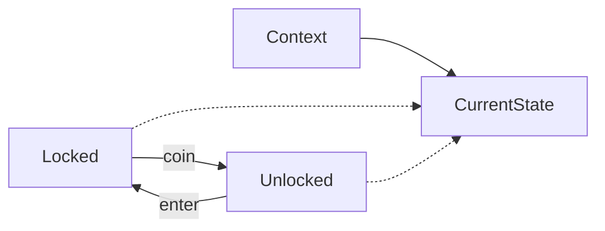

# C++ · 状态（State）

[← C++ 选择指南](README.md) · [Skill 入口](../../SKILL.md) · [可运行源码](../../examples/cpp/state/main.cpp)

**分类：行为型** · **代码目标：C++17**

> 把状态相关行为封装为独立表示，让上下文随状态转换改变响应。

模式意图基于参考站概念页归纳；工程取舍与示例为本项目新编。 [概念依据](https://refactoringguru.cn/design-patterns/state) · [来源边界](../../docs/SOURCES.md)

## 问题与动机

闸机在锁定与解锁状态下对投币和通过有不同反应；在各方法复制状态分支容易遗漏转换。

**本例场景：** 模拟锁定/解锁闸机，测试投币与通过两个事件的转换。

## 适用与避免

**适用：** 同一对象有明确状态图，不同状态的行为或转换规则会继续扩展。

**避免：** 只有两个简单状态且分支集中，枚举与清晰条件表达已足够。

## 结构、参与者与协作

下图是角色关系示意，不是要求每种语言建立相同类层次。动态语言的协议角色可由方法约定承担。



| GoF 角色 | 本例对应职责（成员拼写以代码为准） |
|---|---|
| Context | Gate：持有当前状态并委派事件 |
| State | GateState：coin / enter 等状态行为 |
| ConcreteState | Locked / Unlocked：各自规则与转换 |

1. 先画合法状态和事件转换，不从类名开始。
2. 把状态相关行为放在对应状态对象或封闭状态表示中。
3. 让转换有单一责任位置，明确无效事件是忽略还是错误。

## C++ 实现要点

状态返回转换结果，由 Context 在回调返回后替换对象，避免成员函数执行途中销毁 this。例中两态的迁移结果相同但状态身份不同；复杂状态可返回转换命令。

**实现定位：** 可运行的最小教学实现；语言机制与模式意图分别说明。

## 完整示例

以下代码与独立源码文件逐字同步；无需第三方业务依赖。测试只覆盖代码中实际写出的断言。

```cpp
#include <algorithm>
#include <functional>
#include <iostream>
#include <map>
#include <memory>
#include <stdexcept>
#include <string>
#include <utility>
#include <vector>
using std::string;
void check(bool value) { if (!value) throw std::runtime_error("check failed"); }
template<class F> void expect_error(F action) {
    bool failed = false;
    try { action(); } catch (const std::logic_error&) { failed = true; }
    check(failed);
}

struct GateState { virtual ~GateState() = default; virtual bool open() const = 0; virtual bool coin() const = 0; virtual bool enter() const = 0; };
struct Locked final : GateState { bool open() const override { return false; } bool coin() const override { return true; } bool enter() const override { return false; } };
struct Unlocked final : GateState { bool open() const override { return true; } bool coin() const override { return true; } bool enter() const override { return false; } };
class Gate {
    std::unique_ptr<GateState> state = std::make_unique<Locked>();
    void replace(bool value) {
        if (value) state = std::make_unique<Unlocked>(); else state = std::make_unique<Locked>();
    }
public:
    bool is_open() const { return state->open(); }
    void coin() { bool next = state->coin(); replace(next); }
    void enter() { bool next = state->enter(); replace(next); }
};

int main() {
    Gate gate; check(!gate.is_open());
    gate.enter(); check(!gate.is_open());
    gate.coin(); check(gate.is_open());
    gate.coin(); check(gate.is_open());
    gate.enter(); check(!gate.is_open());
    std::cout << "OK state\n";
}
```

## 运行与验证

从仓库根目录执行（先安装对应工具链）：

```sh
cd examples/cpp/state
g++ -std=c++17 -Wall -Wextra -pedantic main.cpp -o demo
./demo
```

期望标准输出：`OK state`。任何内嵌断言失败都应导致非零退出；Python 不要使用 `-O` 禁用断言，Swift 不要使用 `-Ounchecked`。

**当前源码状态：已通过编译/运行与内嵌断言。** [完整验证记录](../../docs/VERIFICATION.md)。源码 SHA-256：`7f874151fad92afc8ac9dc4a6bdc9760e329df8ba53f5a326cd0ef14b3667132`。

## 收益与代价

**收益**

- 减少散落在多个方法中的状态分支。
- 状态转换规则更可定位、测试。

**代价**

- 增加状态类型和上下文协调。
- 共享有状态的 State 实例会串扰不同上下文。

## 工程边界与常见错误

多线程/异步状态机需串行化事件或使用版本/锁；模式不自动解决竞争。Rust 的 enum+match 是语言适配表达，示例会保留清晰的转换语义而非强造继承。

- 没有定义合法转换图。
- 将运行时策略切换误称为状态，但不存在领域状态。
- 并发事件没有排序或原子性约定。

上述工程要求不是运行一次教学示例便能证明的能力；未特别实现的并发访问、外部 I/O、事务、重试与持久化不在本例保证内。

## 扩展测试建议（不等于已全部实现）

- 初始 Locked，coin 转为 Unlocked，enter 转回 Locked。
- 不合时机的事件遵循约定。
- 多个 Gate 的状态不会相互污染。

针对你的真实输入补充边界/错误用例，再检查替换实现是否保持契约。必要时加入并发竞争、生命周期释放、深度/内存上限和回归测试；不要把断言通过当成生产就绪认证。

## 与替代模式比较

**[策略](strategy.md)：** 策略通常由客户端选择算法；状态由领域事件推动转换，可决定后继状态。

**[模板方法](template-method.md)：** 模板方法固定步骤结构；状态改变对象在不同阶段的响应。

## 来源与继续阅读

- [模式概念](https://refactoringguru.cn/design-patterns/state)
- [C++ Core Guidelines：RAII/所有权](https://isocpp.github.io/CppCoreGuidelines/CppCoreGuidelines#Rr-raii)
- [C++ 工作草案：块作用域声明](https://eel.is/c++draft/stmt.dcl)
- [来源分层、原创范围与未覆盖项](../../docs/SOURCES.md)
