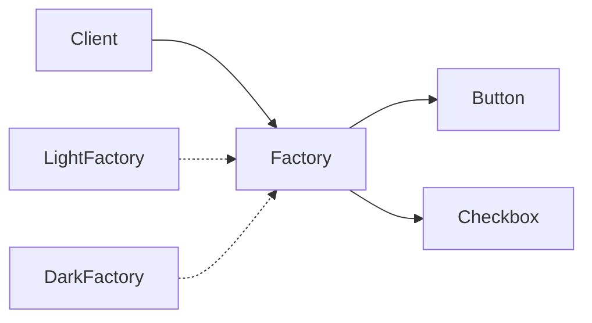

# C# · 抽象工厂（Abstract Factory）

[← C# 选择指南](README.md) · [Skill 入口](../../SKILL.md) · [可运行源码](../../examples/csharp/abstract-factory/Program.cs)

**分类：创建型** · **代码目标：C# 12 / .NET 8**

> 以一个工厂契约创建多种相关产品，使客户端能够整体替换兼容的产品族。

模式意图基于参考站概念页归纳；工程取舍与示例为本项目新编。 [概念依据](https://refactoringguru.cn/design-patterns/abstract-factory) · [来源边界](../../docs/SOURCES.md)

## 问题与动机

按钮和选择框需要保持相同主题；分别选择实现容易混搭，而客户端不应了解每种主题的具体类型。

**本例场景：** 创建浅色与深色两族 Button / Checkbox，客户端只调用产品契约。

## 适用与避免

**适用：** 需要切换主题、平台、协议家族，且一个家族包含多种必须配套的产品。

**避免：** 只有一个产品种类，或者产品之间不需要兼容约束。

## 结构、参与者与协作

下图是角色关系示意，不是要求每种语言建立相同类层次。动态语言的协议角色可由方法约定承担。



| GoF 角色 | 本例对应职责（成员拼写以代码为准） |
|---|---|
| AbstractFactory | IWidgetFactory：button 与 checkbox 两个创建操作 |
| ConcreteFactory | LightFactory / DarkFactory：两个产品族 |
| AbstractProduct | IButton / ICheckbox：不同产品种类 |
| ConcreteProduct | 各主题对应的按钮与选择框实现 |

1. 先列出产品种类与产品族这两个维度。
2. 每种产品定义自己的接口，工厂接口提供对应创建操作。
3. 客户端只接收一个工厂；在组合根统一选择产品族。

## C# 实现要点

两类接口产品由同一工厂形成产品族；record 用于不可变字符串数据，不代表所有 record 都深不可变。族一致性仍由工厂设计与契约测试保证。

**实现定位：** 可运行的最小教学实现；语言机制与模式意图分别说明。

## 完整示例

以下代码与独立源码文件逐字同步；无需第三方业务依赖。测试只覆盖代码中实际写出的断言。

```csharp
using System;
using System.Collections;
using System.Collections.Generic;
using System.Linq;

public static class Program
{
    private static void Check(bool condition)
    {
        if (!condition) throw new InvalidOperationException("check failed");
    }
    private static void ExpectError(Action action)
    {
        bool failed = false;
        try { action(); } catch (ArgumentException) { failed = true; }
        catch (InvalidOperationException) { failed = true; }
        catch (OverflowException) { failed = true; }
        Check(failed);
    }

    public interface IButton { string Draw(); }
    public interface ICheckbox { string Mark(); }
    public sealed record ThemedButton(string Theme) : IButton { public string Draw() => Theme + ":button"; }
    public sealed record ThemedCheckbox(string Theme) : ICheckbox { public string Mark() => Theme + ":checkbox"; }
    public interface IWidgetFactory { IButton Button(); ICheckbox Checkbox(); }
    public sealed class LightFactory : IWidgetFactory
    {
        public IButton Button() => new ThemedButton("light");
        public ICheckbox Checkbox() => new ThemedCheckbox("light");
    }
    public sealed class DarkFactory : IWidgetFactory
    {
        public IButton Button() => new ThemedButton("dark");
        public ICheckbox Checkbox() => new ThemedCheckbox("dark");
    }
    public static string Screen(IWidgetFactory f) => f.Button().Draw() + "/" + f.Checkbox().Mark();

    public static void Main()
    {
        Check(Screen(new LightFactory()) == "light:button/light:checkbox");
        Check(Screen(new DarkFactory()) == "dark:button/dark:checkbox");
        Console.WriteLine("OK abstract-factory");
    }
}
```

## 运行与验证

从仓库根目录执行（先安装对应工具链）：

```sh
dotnet run --project examples/csharp/abstract-factory/Example.csproj --configuration Release
```

期望标准输出：`OK abstract-factory`。任何内嵌断言失败都应导致非零退出；Python 不要使用 `-O` 禁用断言，Swift 不要使用 `-Ounchecked`。

**当前源码状态：待验证（无匹配当前源码哈希的运行记录）。** [完整验证记录](../../docs/VERIFICATION.md)。源码 SHA-256：`fd0c4880117cce8ff2505cc54ea079fc048c635063681157aa50489fb49fe822`。

## 收益与代价

**收益**

- 避免客户端散落具体平台类。
- 把产品族切换集中在一个边界。

**代价**

- 增加新产品族较容易；增加新的产品种类通常要改所有工厂。
- 接口只提供组织边界，不自动证明所有业务兼容约束。

## 工程边界与常见错误

共享有状态工厂需定义线程安全；产品的释放责任不会因工厂模式而消失。不要把每个产品都自动做成单例。

- 只返回一类产品，却称为抽象工厂。
- 绕开工厂直接 new 另一主题的产品。
- 把家族兼容性当作所有语言都会自动静态保证的属性。

上述工程要求不是运行一次教学示例便能证明的能力；未特别实现的并发访问、外部 I/O、事务、重试与持久化不在本例保证内。

## 扩展测试建议（不等于已全部实现）

- 分别创建两个产品族，并验证每族的两类产品风格一致。
- 客户端逻辑不需要区分具体工厂。
- 需要强类型家族约束时额外添加类型级或契约测试。

针对你的真实输入补充边界/错误用例，再检查替换实现是否保持契约。必要时加入并发竞争、生命周期释放、深度/内存上限和回归测试；不要把断言通过当成生产就绪认证。

## 与替代模式比较

**[工厂方法](factory-method.md)：** 抽象工厂面向多种产品组成的族，可由多个工厂方法实现。

**[桥接](bridge.md)：** 桥接隔离两个可独立变化的行为维度；抽象工厂负责选择并创建对象族。

## 来源与继续阅读

- [模式概念](https://refactoringguru.cn/design-patterns/abstract-factory)
- [C# 接口](https://learn.microsoft.com/en-us/dotnet/csharp/fundamentals/types/interfaces)
- [Lazy<T>](https://learn.microsoft.com/en-us/dotnet/api/system.lazy-1?view=net-8.0)
- [来源分层、原创范围与未覆盖项](../../docs/SOURCES.md)
