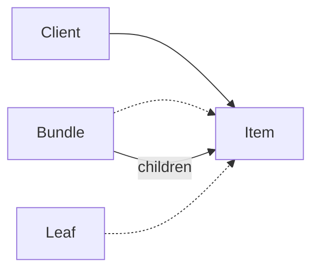

# C# · 组合（Composite）

[← C# 选择指南](README.md) · [Skill 入口](../../SKILL.md) · [可运行源码](../../examples/csharp/composite/Program.cs)

**分类：结构型** · **代码目标：C# 12 / .NET 8**

> 让叶子和由子节点组成的容器遵循同一操作契约，以统一处理树形结构。

模式意图基于参考站概念页归纳；工程取舍与示例为本项目新编。 [概念依据](https://refactoringguru.cn/design-patterns/composite) · [来源边界](../../docs/SOURCES.md)

## 问题与动机

订单可以包含单项与嵌套套餐；客户端不应在每层都区分容器和单项再重复递归。

**本例场景：** 对嵌套 LineItem / Bundle 统一调用 total，计算教学整数值。

## 适用与避免

**适用：** 领域天然是树形的整体—部分结构，叶子与容器存在有意义的共同操作。

**避免：** 结构本质是含环的图，或共同接口必须塞入大量叶子不支持的操作。

## 结构、参与者与协作

下图是角色关系示意，不是要求每种语言建立相同类层次。动态语言的协议角色可由方法约定承担。



| GoF 角色 | 本例对应职责（成员拼写以代码为准） |
|---|---|
| Component | IItem：total 操作 |
| Leaf | LineItem：固定数值 |
| Composite | Bundle：持有多个 IItem 并汇总 |

1. 提取叶子与容器都合理支持的操作。
2. 容器持有同一 Component 契约的子节点。
3. 从根节点发起操作，由容器递归委派给孩子。

## C# 实现要点

ToArray 固定当前成员列表，接口叶子和组合统一求值；IEnumerable 参数可来自惰性源，枚举时失败不能被忽略。深度、null 子节点和引用环仍需入口约束。

**实现定位：** 可运行的最小教学实现；语言机制与模式意图分别说明。

## 完整示例

以下代码与独立源码文件逐字同步；无需第三方业务依赖。测试只覆盖代码中实际写出的断言。

```csharp
using System;
using System.Collections;
using System.Collections.Generic;
using System.Linq;

public static class Program
{
    private static void Check(bool condition)
    {
        if (!condition) throw new InvalidOperationException("check failed");
    }
    private static void ExpectError(Action action)
    {
        bool failed = false;
        try { action(); } catch (ArgumentException) { failed = true; }
        catch (InvalidOperationException) { failed = true; }
        catch (OverflowException) { failed = true; }
        Check(failed);
    }

    public interface IItem { int Total(); }
    public sealed class LineItem : IItem
    {
        private readonly int price;
        public LineItem(int price) { if (price < 0) throw new ArgumentException("price"); this.price = price; }
        public int Total() => price;
    }
    public sealed class Bundle : IItem
    {
        private readonly IItem[] children;
        public Bundle(IEnumerable<IItem> children) { this.children = children.ToArray(); }
        public int Total() => children.Sum(item => item.Total());
    }

    public static void Main()
    {
        var root = new Bundle(new IItem[] { new LineItem(10), new Bundle(new IItem[] { new LineItem(20), new LineItem(30) }) });
        Check(root.Total() == 60);
        Check(new Bundle(Array.Empty<IItem>()).Total() == 0);
        ExpectError(() => new LineItem(-1));
        Console.WriteLine("OK composite");
    }
}
```

## 运行与验证

从仓库根目录执行（先安装对应工具链）：

```sh
dotnet run --project examples/csharp/composite/Example.csproj --configuration Release
```

期望标准输出：`OK composite`。任何内嵌断言失败都应导致非零退出；Python 不要使用 `-O` 禁用断言，Swift 不要使用 `-Ounchecked`。

**当前源码状态：已通过编译/运行与内嵌断言。** [完整验证记录](../../docs/VERIFICATION.md)。源码 SHA-256：`b95b6894557a91be586d8cfbfcd47ad3894338ce3f49b9a5ec53489541549038`。

## 收益与代价

**收益**

- 客户端统一处理单个对象与子树。
- 树结构能够组合与局部替换。

**代价**

- 限制子节点类型或维护父引用时更复杂。
- 深树有递归栈成本，图结构需另加环检测。

## 工程边界与常见错误

示例不允许客户端直接修改内部孩子集合，也不宣称处理任意有环图。大规模树应考虑迭代遍历、深度限制或显式栈。

- 让叶子实现无意义的 add/remove。
- 允许把祖先加入子树造成无限递归。
- 共享可变子节点却没有所有权规则。

上述工程要求不是运行一次教学示例便能证明的能力；未特别实现的并发访问、外部 I/O、事务、重试与持久化不在本例保证内。

## 扩展测试建议（不等于已全部实现）

- 嵌套套餐总值等于叶子值之和。
- 空容器得到约定的单位元 0。
- 生产树操作另测深度、环和共享节点策略。

针对你的真实输入补充边界/错误用例，再检查替换实现是否保持契约。必要时加入并发竞争、生命周期释放、深度/内存上限和回归测试；不要把断言通过当成生产就绪认证。

## 与替代模式比较

**[装饰](decorator.md)：** 组合通常有多个孩子并汇聚结果；装饰通常包装一个部件并叠加责任。

**[访问者](visitor.md)：** 组合组织对象树；访问者为稳定的节点类型添加新操作，两者常配合。

## 来源与继续阅读

- [模式概念](https://refactoringguru.cn/design-patterns/composite)
- [C# 接口](https://learn.microsoft.com/en-us/dotnet/csharp/fundamentals/types/interfaces)
- [Lazy<T>](https://learn.microsoft.com/en-us/dotnet/api/system.lazy-1?view=net-8.0)
- [来源分层、原创范围与未覆盖项](../../docs/SOURCES.md)
