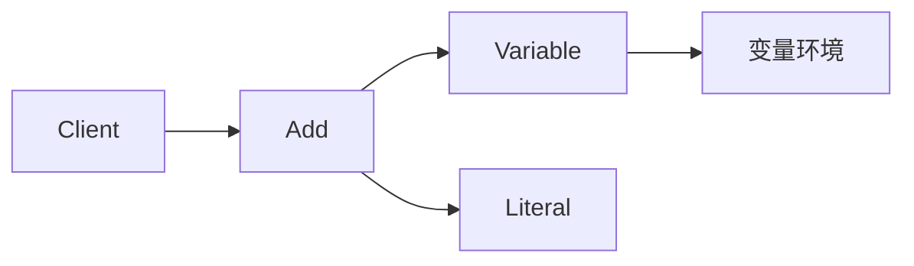

# C# · 解释器（Interpreter）

[← C# 选择指南](README.md) · [Skill 入口](../../SKILL.md) · [可运行源码](../../examples/csharp/interpreter/Program.cs)

**分类：行为型** · **代码目标：C# 12 / .NET 8**

> 用语言的语法结构表示表达式，并在给定上下文中解释其含义。

本页补充 GoF 解释器；用户参考站目录未收录此项。 [概念依据](https://sourcemaking.com/design_patterns/interpreter) · [来源边界](../../docs/SOURCES.md)

## 问题与动机

一组小型规则需要组合变量与常量，而不是执行任意宿主语言代码。

**本例场景：** 只解释受限的 Literal、Variable、Add 三类 AST 节点，不使用 eval。

## 适用与避免

**适用：** 文法小且稳定、表达式可以组成语法树，需要可控的领域规则求值。

**避免：** 语言复杂或不可信输入需要完整解析、资源治理；此时应使用成熟解析器/执行引擎。

## 结构、参与者与协作

下图是角色关系示意，不是要求每种语言建立相同类层次。动态语言的协议角色可由方法约定承担。



| GoF 角色 | 本例对应职责（成员拼写以代码为准） |
|---|---|
| AbstractExpression | IExpr：evaluate(context) |
| TerminalExpression | Literal / Variable：常量与变量 |
| NonterminalExpression | Add：组合子表达式 |
| Context | 变量到值的映射 |

1. 明确文法与变量环境，而不是直接调用 eval。
2. 为终结符和非终结符建立表达式节点。
3. 递归解释 AST，显式处理缺失变量与非法输入。

## C# 实现要点

record AST 加 IReadOnlyDictionary 环境，checked 显式定义溢出失败。IReadOnly 接口不保证底层字典不可并发修改；无解析器/任意代码执行功能。

**实现定位：** 可运行的最小教学实现；语言机制与模式意图分别说明。

## 完整示例

以下代码与独立源码文件逐字同步；无需第三方业务依赖。测试只覆盖代码中实际写出的断言。

```csharp
using System;
using System.Collections;
using System.Collections.Generic;
using System.Linq;

public static class Program
{
    private static void Check(bool condition)
    {
        if (!condition) throw new InvalidOperationException("check failed");
    }
    private static void ExpectError(Action action)
    {
        bool failed = false;
        try { action(); } catch (ArgumentException) { failed = true; }
        catch (InvalidOperationException) { failed = true; }
        catch (OverflowException) { failed = true; }
        Check(failed);
    }

    public interface IExpr { int Evaluate(IReadOnlyDictionary<string, int> context); }
    public sealed record Literal(int Value) : IExpr { public int Evaluate(IReadOnlyDictionary<string, int> context) => Value; }
    public sealed record Variable(string Name) : IExpr
    {
        public int Evaluate(IReadOnlyDictionary<string, int> context)
        {
            if (!context.TryGetValue(Name, out int value)) throw new ArgumentException("unknown variable");
            return value;
        }
    }
    public sealed record Add(IExpr Left, IExpr Right) : IExpr
    {
        public int Evaluate(IReadOnlyDictionary<string, int> context) => checked(Left.Evaluate(context) + Right.Evaluate(context));
    }

    public static void Main()
    {
        IExpr expr = new Add(new Variable("x"), new Literal(2));
        Check(expr.Evaluate(new Dictionary<string, int> { ["x"] = 3 }) == 5);
        ExpectError(() => expr.Evaluate(new Dictionary<string, int>()));
        ExpectError(() => new Add(new Literal(int.MaxValue), new Literal(1)).Evaluate(new Dictionary<string, int>()));
        Console.WriteLine("OK interpreter");
    }
}
```

## 运行与验证

从仓库根目录执行（先安装对应工具链）：

```sh
dotnet run --project examples/csharp/interpreter/Example.csproj --configuration Release
```

期望标准输出：`OK interpreter`。任何内嵌断言失败都应导致非零退出；Python 不要使用 `-O` 禁用断言，Swift 不要使用 `-Ounchecked`。

**当前源码状态：待验证（无匹配当前源码哈希的运行记录）。** [完整验证记录](../../docs/VERIFICATION.md)。源码 SHA-256：`e20810565f4db00549f11fddd12896022f0d3013b021d14b73dc4537779646cb`。

## 收益与代价

**收益**

- 语义可以由小节点组合。
- 容易为受限 DSL 编写独立规则测试。

**代价**

- 文法复杂时节点数量和维护成本增加。
- 解释开销、深度与输入大小必须限制。

## 工程边界与常见错误

这是 GoF 23 的补充项，不在用户参考站的 22 项目录中。示例手工构建 AST，没有字符串解析器，没有沙箱承诺。求值不得反射调用任意业务方法。

- 把直接 eval 用户字符串称为安全解释器。
- 只有 AST 求值却声称已经实现词法分析和解析。
- 递归输入没有深度、时间或资源限制。

上述工程要求不是运行一次教学示例便能证明的能力；未特别实现的并发访问、外部 I/O、事务、重试与持久化不在本例保证内。

## 扩展测试建议（不等于已全部实现）

- x=3 时 Add(Variable(x), Literal(2)) 求值得到 5。
- 缺少变量时明确失败。
- 生产解析器另测优先级、非法 token 和最大深度。

针对你的真实输入补充边界/错误用例，再检查替换实现是否保持契约。必要时加入并发竞争、生命周期释放、深度/内存上限和回归测试；不要把断言通过当成生产就绪认证。

## 与替代模式比较

**[组合](composite.md)：** 表达式 AST 常用组合组织树；解释器为语法节点规定求值含义。

**[访问者](visitor.md)：** 解释器可把求值放在节点中；访问者能把不同树操作移到外部。

## 来源与继续阅读

- [模式概念](https://sourcemaking.com/design_patterns/interpreter)
- [C# 接口](https://learn.microsoft.com/en-us/dotnet/csharp/fundamentals/types/interfaces)
- [Lazy<T>](https://learn.microsoft.com/en-us/dotnet/api/system.lazy-1?view=net-8.0)
- [来源分层、原创范围与未覆盖项](../../docs/SOURCES.md)
