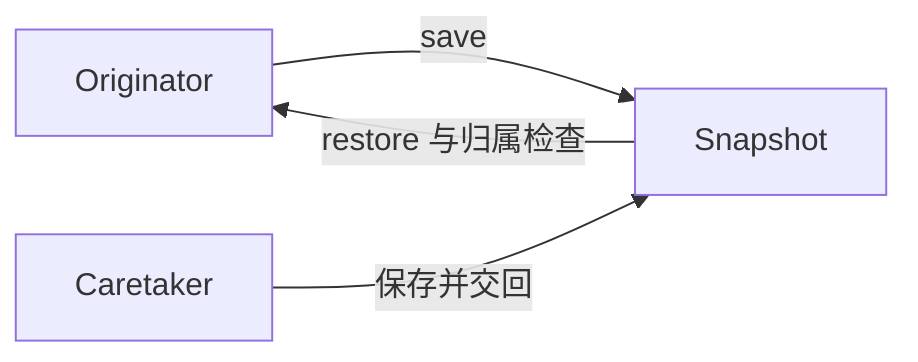

# C# · 备忘录（Memento）

[← C# 选择指南](README.md) · [Skill 入口](../../SKILL.md) · [可运行源码](../../examples/csharp/memento/Program.cs)

**分类：行为型** · **代码目标：C# 12 / .NET 8**

> 由原发器创建并解释不透明快照，让外部保存者无需暴露内部状态就能保存与恢复。

模式意图基于参考站概念页归纳；工程取舍与示例为本项目新编。 [概念依据](https://refactoringguru.cn/design-patterns/memento) · [来源边界](../../docs/SOURCES.md)

## 问题与动机

编辑器要保存历史，但历史栈不应该知道文本与内部状态如何表示。

**本例场景：** Editor 保存不透明 Snapshot；编辑后恢复，并拒绝另一编辑器的快照。

## 适用与避免

**适用：** 需要撤销、检查点或恢复，且快照大小与敏感信息可控。

**避免：** 状态巨大或包含不可恢复的外部副作用；不能把快照当成分布式事务。

## 结构、参与者与协作

下图是角色关系示意，不是要求每种语言建立相同类层次。动态语言的协议角色可由方法约定承担。



| GoF 角色 | 本例对应职责（成员拼写以代码为准） |
|---|---|
| Originator | Editor：创建和恢复快照 |
| Memento | Snapshot：保存状态与所属原发器标识 |
| Caretaker | 演示历史变量：只保存并交回 Snapshot |

1. 让原发器定义快照内容，不由外部窥探字段。
2. 使用不可变或独立复制状态，防止历史被后续编辑改变。
3. 恢复时验证归属与必要的版本，不解释来自任意对象的快照。

## C# 实现要点

私有嵌套快照通过公开标记接口交给管理者，字符串不可变。身份令牌拒绝跨源发器恢复；反射与序列化攻击不属于此封装模型的安全保证。

**实现定位：** 可运行的最小教学实现；语言机制与模式意图分别说明。

## 完整示例

以下代码与独立源码文件逐字同步；无需第三方业务依赖。测试只覆盖代码中实际写出的断言。

```csharp
using System;
using System.Collections;
using System.Collections.Generic;
using System.Linq;

public static class Program
{
    private static void Check(bool condition)
    {
        if (!condition) throw new InvalidOperationException("check failed");
    }
    private static void ExpectError(Action action)
    {
        bool failed = false;
        try { action(); } catch (ArgumentException) { failed = true; }
        catch (InvalidOperationException) { failed = true; }
        catch (OverflowException) { failed = true; }
        Check(failed);
    }

    public interface IMemento { }
    public sealed class Editor
    {
        private sealed record Snapshot(object Owner, string Text) : IMemento;
        private readonly object owner = new();
        public string Text { get; set; } = "";
        public IMemento Save() => new Snapshot(owner, Text);
        public void Restore(IMemento memento)
        {
            if (memento is not Snapshot snapshot || !ReferenceEquals(snapshot.Owner, owner))
                throw new ArgumentException("foreign snapshot");
            Text = snapshot.Text;
        }
    }

    public static void Main()
    {
        var a = new Editor(); var b = new Editor();
        a.Text = "one"; IMemento saved = a.Save(); a.Text = "two";
        a.Restore(saved); Check(a.Text == "one");
        ExpectError(() => b.Restore(saved));
        Console.WriteLine("OK memento");
    }
}
```

## 运行与验证

从仓库根目录执行（先安装对应工具链）：

```sh
dotnet run --project examples/csharp/memento/Example.csproj --configuration Release
```

期望标准输出：`OK memento`。任何内嵌断言失败都应导致非零退出；Python 不要使用 `-O` 禁用断言，Swift 不要使用 `-Ounchecked`。

**当前源码状态：已通过编译/运行与内嵌断言。** [完整验证记录](../../docs/VERIFICATION.md)。源码 SHA-256：`00f64208669d9ddcb2da1143840c4a8c24999f664eab5748f3c88773b940279e`。

## 收益与代价

**收益**

- 历史保存者不依赖内部状态布局。
- 支持恢复而不把状态变成公开 API。

**代价**

- 快照会消耗内存和持久化空间。
- 保存敏感数据、版本迁移与恢复时机都需要额外策略。

## 工程边界与常见错误

动态语言的封装依赖约定时会明确说明，不声称私有字段是安全边界。示例只有内存文本；持久化快照需设版本、访问控制、保留周期和完整性验证。

- 外部保存者直接修改快照内部状态。
- 浅复制导致历史也随当前内容变化。
- 把别的对象的快照交给当前对象恢复。

上述工程要求不是运行一次教学示例便能证明的能力；未特别实现的并发访问、外部 I/O、事务、重试与持久化不在本例保证内。

## 扩展测试建议（不等于已全部实现）

- 编辑后恢复得到原来的内容。
- 历史快照不受后续编辑影响。
- 不属于当前原发器的快照被拒绝。

针对你的真实输入补充边界/错误用例，再检查替换实现是否保持契约。必要时加入并发竞争、生命周期释放、深度/内存上限和回归测试；不要把断言通过当成生产就绪认证。

## 与替代模式比较

**[原型](prototype.md)：** 备忘录恢复原发器；原型创建另一个实例。

**[命令](command.md)：** 命令表示操作；备忘录保存状态，可作为命令撤销机制。

## 来源与继续阅读

- [模式概念](https://refactoringguru.cn/design-patterns/memento)
- [C# 接口](https://learn.microsoft.com/en-us/dotnet/csharp/fundamentals/types/interfaces)
- [Lazy<T>](https://learn.microsoft.com/en-us/dotnet/api/system.lazy-1?view=net-8.0)
- [来源分层、原创范围与未覆盖项](../../docs/SOURCES.md)
