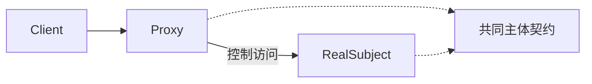

# C# · 代理（Proxy）

[← C# 选择指南](README.md) · [Skill 入口](../../SKILL.md) · [可运行源码](../../examples/csharp/proxy/Program.cs)

**分类：结构型** · **代码目标：C# 12 / .NET 8**

> 提供与主体相同的契约，在访问主体之前或之后实施访问控制或生命周期策略。

模式意图基于参考站概念页归纳；工程取舍与示例为本项目新编。 [概念依据](https://refactoringguru.cn/design-patterns/proxy) · [来源边界](../../docs/SOURCES.md)

## 问题与动机

图像对象昂贵，但并非所有请求都会读取图像；客户端又不应自己管理延迟加载。

**本例场景：** 使用内存计数器观察图像在首次 render 才被创建。

## 适用与避免

**适用：** 需要延迟加载、访问保护、缓存或远程调用边界，且客户端仍面向相同主体契约。

**避免：** 仅为隐藏所有网络成本或失败而宣称远程对象和本地对象完全透明。

## 结构、参与者与协作

下图是角色关系示意，不是要求每种语言建立相同类层次。动态语言的协议角色可由方法约定承担。



| GoF 角色 | 本例对应职责（成员拼写以代码为准） |
|---|---|
| Subject | IImage：read 操作 |
| RealSubject | RealImage：实际载入图像的模拟主体 |
| Proxy | LazyImage：首次访问才创建并缓存主体 |

1. 定义主体契约，保留失败和成本语义。
2. 代理实现同一契约，控制创建或调用时机。
3. 测量主体调用次数，明确缓存和并发的行为。

## C# 实现要点

可空引用使未初始化状态显式化；此例故意不是线程安全初始化。需要并发保证时可比较 Lazy<T>，同时明确工厂失败、重试与资源释放策略。

**实现定位：** 可运行的最小教学实现；语言机制与模式意图分别说明。

## 完整示例

以下代码与独立源码文件逐字同步；无需第三方业务依赖。测试只覆盖代码中实际写出的断言。

```csharp
using System;
using System.Collections;
using System.Collections.Generic;
using System.Linq;

public static class Program
{
    private static void Check(bool condition)
    {
        if (!condition) throw new InvalidOperationException("check failed");
    }
    private static void ExpectError(Action action)
    {
        bool failed = false;
        try { action(); } catch (ArgumentException) { failed = true; }
        catch (InvalidOperationException) { failed = true; }
        catch (OverflowException) { failed = true; }
        Check(failed);
    }

    public interface IImage { string Read(); }
    public sealed class RealImage : IImage { public string Read() => "pixels"; }
    public sealed class LazyImage : IImage
    {
        private RealImage? real;
        public int Loads { get; private set; }
        public string Read()
        {
            if (real is null) { real = new RealImage(); Loads++; }
            return real.Read();
        }
    }

    public static void Main()
    {
        var image = new LazyImage(); Check(image.Loads == 0);
        Check(image.Read() == "pixels" && image.Read() == "pixels");
        Check(image.Loads == 1);
        Console.WriteLine("OK proxy");
    }
}
```

## 运行与验证

从仓库根目录执行（先安装对应工具链）：

```sh
dotnet run --project examples/csharp/proxy/Example.csproj --configuration Release
```

期望标准输出：`OK proxy`。任何内嵌断言失败都应导致非零退出；Python 不要使用 `-O` 禁用断言，Swift 不要使用 `-Ounchecked`。

**当前源码状态：待验证（无匹配当前源码哈希的运行记录）。** [完整验证记录](../../docs/VERIFICATION.md)。源码 SHA-256：`48b4c6a67e3e8673675b07888bdf9b2a5e2c99fc032028358fe01e3e71320d4c`。

## 收益与代价

**收益**

- 把访问与生命周期策略从业务调用方分离。
- 可以替换昂贵主体用于测试。

**代价**

- 存在隐含延迟、额外状态或远程失败。
- 缓存失效与权限变更会增加复杂度。

## 工程边界与常见错误

本例只展示虚拟代理，不是安全代理或分布式 RPC 实现。线程安全延迟创建、取消、超时、缓存失效需要根据实际环境另设计。

- 代理和主体的接口逐渐不兼容。
- 缓存敏感响应却未纳入身份或权限键。
- 并发首次访问重复创建主体。

上述工程要求不是运行一次教学示例便能证明的能力；未特别实现的并发访问、外部 I/O、事务、重试与持久化不在本例保证内。

## 扩展测试建议（不等于已全部实现）

- 构造代理时尚未载入主体。
- 两次 render 只触发一次主体创建。
- 生产场景另测失败后是否重试和并发首次访问。

针对你的真实输入补充边界/错误用例，再检查替换实现是否保持契约。必要时加入并发竞争、生命周期释放、深度/内存上限和回归测试；不要把断言通过当成生产就绪认证。

## 与替代模式比较

**[装饰](decorator.md)：** 代理控制访问，装饰叠加责任；结构相似时按意图而非类名判断。

**[外观（门面）](facade.md)：** 代理保持主体契约；外观提供简化后的子系统接口。

## 来源与继续阅读

- [模式概念](https://refactoringguru.cn/design-patterns/proxy)
- [C# 接口](https://learn.microsoft.com/en-us/dotnet/csharp/fundamentals/types/interfaces)
- [Lazy<T>](https://learn.microsoft.com/en-us/dotnet/api/system.lazy-1?view=net-8.0)
- [来源分层、原创范围与未覆盖项](../../docs/SOURCES.md)
