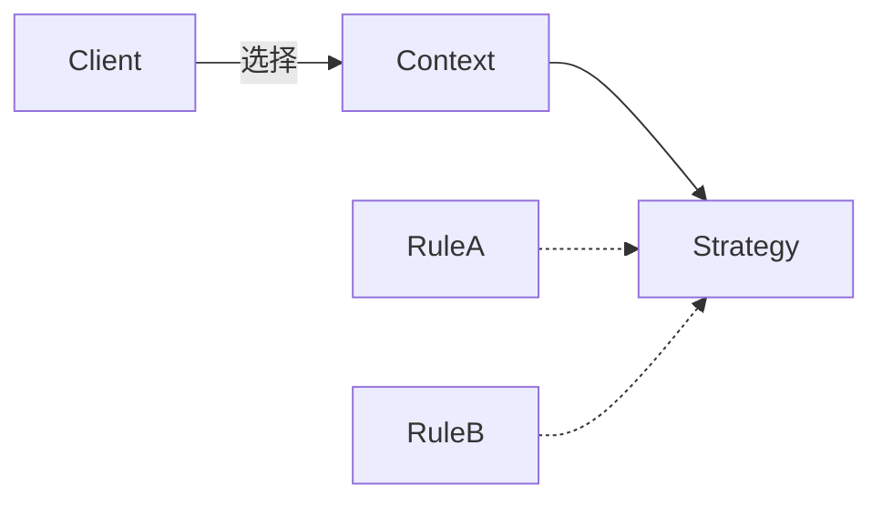

# C# · 策略（Strategy）

[← C# 选择指南](README.md) · [Skill 入口](../../SKILL.md) · [可运行源码](../../examples/csharp/strategy/Program.cs)

**分类：行为型** · **代码目标：C# 12 / .NET 8**

> 把可互换的算法放在同一契约后，由上下文委派给当前选择的实现。

模式意图基于参考站概念页归纳；工程取舍与示例为本项目新编。 [概念依据](https://refactoringguru.cn/design-patterns/strategy) · [来源边界](../../docs/SOURCES.md)

## 问题与动机

同一结算过程需要替换折扣规则；不断扩展条件分支会把算法与调用流程绑在一起。

**本例场景：** Pricing 注入不同整数折扣函数，使用相同调用流程得到 90 或 80。

## 适用与避免

**适用：** 存在真实、可互换的算法族，需要独立测试或运行时选择。

**避免：** 只有一条稳定算法，或者参数本身已能清楚表达差异。

## 结构、参与者与协作

下图是角色关系示意，不是要求每种语言建立相同类层次。动态语言的协议角色可由方法约定承担。



| GoF 角色 | 本例对应职责（成员拼写以代码为准） |
|---|---|
| Strategy | 折扣函数或策略接口：整数输入到整数输出 |
| ConcreteStrategy | 减 10 与减 20 的两条教学规则 |
| Context | Pricing：委派给注入的策略 |

1. 定义所有算法共同的输入、输出和约束。
2. 把变化算法提取成函数或对象，不强制每条规则都建类。
3. 在组合根选择算法，上下文仅通过契约调用。

## C# 实现要点

Func 委托适合单算法策略；需要多个操作、资源或生命周期时再引入策略接口。示例参数受测试域约束，不用于真实币种精度计算。

**实现定位：** 可运行的最小教学实现；语言机制与模式意图分别说明。

## 完整示例

以下代码与独立源码文件逐字同步；无需第三方业务依赖。测试只覆盖代码中实际写出的断言。

```csharp
using System;
using System.Collections;
using System.Collections.Generic;
using System.Linq;

public static class Program
{
    private static void Check(bool condition)
    {
        if (!condition) throw new InvalidOperationException("check failed");
    }
    private static void ExpectError(Action action)
    {
        bool failed = false;
        try { action(); } catch (ArgumentException) { failed = true; }
        catch (InvalidOperationException) { failed = true; }
        catch (OverflowException) { failed = true; }
        Check(failed);
    }

    public sealed class Pricing
    {
        public Func<int, int> Rule { get; set; }
        public Pricing(Func<int, int> rule) { Rule = rule; }
        public int Quote(int value)
        {
            if (value < 0) throw new ArgumentException("base");
            return Rule(value);
        }
    }
    public static Func<int, int> Discount(int amount) => value => Math.Max(0, value - amount);

    public static void Main()
    {
        var pricing = new Pricing(Discount(10)); Check(pricing.Quote(100) == 90);
        pricing.Rule = Discount(20);
        Check(pricing.Quote(100) == 80 && pricing.Quote(5) == 0);
        ExpectError(() => pricing.Quote(-1));
        Console.WriteLine("OK strategy");
    }
}
```

## 运行与验证

从仓库根目录执行（先安装对应工具链）：

```sh
dotnet run --project examples/csharp/strategy/Example.csproj --configuration Release
```

期望标准输出：`OK strategy`。任何内嵌断言失败都应导致非零退出；Python 不要使用 `-O` 禁用断言，Swift 不要使用 `-Ounchecked`。

**当前源码状态：待验证（无匹配当前源码哈希的运行记录）。** [完整验证记录](../../docs/VERIFICATION.md)。源码 SHA-256：`473306bbbdbb113a6dcb5a5a9e2aa993332e537c4d9ecc3a2be0c50f8261339b`。

## 收益与代价

**收益**

- 算法可替换、组合并独立测试。
- 上下文不依赖具体算法实现。

**代价**

- 客户端需要知道该选哪条策略。
- 算法太简单时抽象可能比条件表达更难读。

## 工程边界与常见错误

示例用整数展示算法选择，不是财务定价系统。实际规则需明确金额单位、舍入、税费与输入边界；纯函数通常比无必要的类层次更容易验证。

- 把业务规则仍塞回上下文的大 switch。
- 各策略实际输入或错误语义不兼容。
- 策略持有共享可变状态却被当作纯函数。

上述工程要求不是运行一次教学示例便能证明的能力；未特别实现的并发访问、外部 I/O、事务、重试与持久化不在本例保证内。

## 扩展测试建议（不等于已全部实现）

- 同一上下文接口配两种算法，输出分别正确。
- 替换算法无需修改调用流程。
- 按实际领域补充合法输入与边界测试。

针对你的真实输入补充边界/错误用例，再检查替换实现是否保持契约。必要时加入并发竞争、生命周期释放、深度/内存上限和回归测试；不要把断言通过当成生产就绪认证。

## 与替代模式比较

**[状态](state.md)：** 策略替换算法；状态表达领域阶段及其转换。

**[模板方法](template-method.md)：** 策略通过组合替换算法；模板方法通过固定骨架和覆写步骤扩展。

## 来源与继续阅读

- [模式概念](https://refactoringguru.cn/design-patterns/strategy)
- [C# 接口](https://learn.microsoft.com/en-us/dotnet/csharp/fundamentals/types/interfaces)
- [Lazy<T>](https://learn.microsoft.com/en-us/dotnet/api/system.lazy-1?view=net-8.0)
- [来源分层、原创范围与未覆盖项](../../docs/SOURCES.md)
