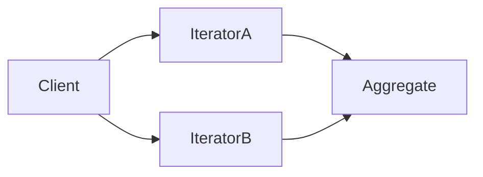

# Go · 迭代器（Iterator）

[← Go 选择指南](README.md) · [Skill 入口](../../SKILL.md) · [可运行源码](../../examples/go/iterator/main.go)

**分类：行为型** · **代码目标：Go 1.20 语法/API 目标；示例不依赖 1.23 range 函数**

> 在不暴露集合内部表示的前提下提供顺序访问元素的机制。

模式意图基于参考站概念页归纳；工程取舍与示例为本项目新编。 [概念依据](https://refactoringguru.cn/design-patterns/iterator) · [来源边界](../../docs/SOURCES.md)

## 问题与动机

调用方只需逐个读取集合，却不该直接操作集合的存储结构或共享一个全局游标。

**本例场景：** 自定义 Bag 对接语言原生遍历方式，并验证两个独立迭代位置。

## 适用与避免

**适用：** 需要统一遍历不同集合、惰性读取，或让多个遍历彼此独立。

**避免：** 语言已经提供足够的集合协议，却再包装出不兼容的 next/hasNext 框架。

## 结构、参与者与协作

下图是角色关系示意，不是要求每种语言建立相同类层次。动态语言的协议角色可由方法约定承担。



| GoF 角色 | 本例对应职责（成员拼写以代码为准） |
|---|---|
| Aggregate | Bag：隐藏底层元素集合 |
| Iterator | 语言原生迭代器/生成器：保存各自位置 |
| Client | 创建两个独立游标并消费 |

1. 优先实现语言原生遍历协议。
2. 集合与游标分开，每次请求返回独立游标。
3. 约定空集合、结束以及遍历期间修改的语义。

## Go 实现要点

为兼容 Go 1.20，使用显式 Next() (value, ok) 协议与独立游标。Go 1.23 的 range-over-function 是另一种语言支持路径，不能假设旧版本具备。

**实现定位：** 可运行的最小教学实现；语言机制与模式意图分别说明。

## 完整示例

以下代码与独立源码文件逐字同步；无需第三方业务依赖。测试只覆盖代码中实际写出的断言。

```go
package main

import (
	"fmt"
)

func check(ok bool) {
	if !ok {
		panic("check failed")
	}
}

type Bag struct{ values []int }

func NewBag(values []int) Bag { return Bag{append([]int(nil), values...)} }

type Cursor struct {
	values []int
	index  int
}

func (b Bag) Iterator() *Cursor { return &Cursor{values: b.values} }
func (c *Cursor) Next() (int, bool) {
	if c.index >= len(c.values) {
		return 0, false
	}
	value := c.values[c.index]
	c.index++
	return value, true
}

func main() {
	bag := NewBag([]int{1, 2, 3})
	a, b := bag.Iterator(), bag.Iterator()
	x, ok := a.Next()
	check(ok && x == 1)
	x, ok = a.Next()
	check(ok && x == 2)
	x, ok = b.Next()
	check(ok && x == 1)
	empty := NewBag(nil).Iterator()
	_, ok = empty.Next()
	check(!ok)
	a.Next()
	_, ok = a.Next()
	check(!ok)
	fmt.Println("OK iterator")
}
```

## 运行与验证

从仓库根目录执行（先安装对应工具链）：

```sh
go run examples/go/iterator/main.go
```

期望标准输出：`OK iterator`。任何内嵌断言失败都应导致非零退出；Python 不要使用 `-O` 禁用断言，Swift 不要使用 `-Ounchecked`。

**当前源码状态：已通过编译/运行与内嵌断言。** [完整验证记录](../../docs/VERIFICATION.md)。源码 SHA-256：`149b1f90f9fba65ffe7fc5f3da944fb096d4c52d82ee752d4f0972892653c7b1`。

## 收益与代价

**收益**

- 遍历算法不依赖底层存储。
- 可支持惰性计算与多个独立遍历。

**代价**

- 有状态游标通常不是线程安全对象。
- 外部资源流需要额外关闭/取消契约。

## 工程边界与常见错误

本例采用稳定集合/快照语义，避免修改期间的不确定行为。惰性并不等于异步，也不保证零内存；资源型迭代应有关闭和提前退出测试。

- 集合自己兼任唯一游标，嵌套遍历互相覆盖。
- 迭代耗尽后行为不符合语言协议。
- 遍历时修改集合却没有一致性约定。

上述工程要求不是运行一次教学示例便能证明的能力；未特别实现的并发访问、外部 I/O、事务、重试与持久化不在本例保证内。

## 扩展测试建议（不等于已全部实现）

- 两个游标第一次读取都得到第一个元素。
- 完整遍历得到预期顺序与数量。
- 空集合与耗尽状态遵循协议。

针对你的真实输入补充边界/错误用例，再检查替换实现是否保持契约。必要时加入并发竞争、生命周期释放、深度/内存上限和回归测试；不要把断言通过当成生产就绪认证。

## 与替代模式比较

**[访问者](visitor.md)：** 迭代器解决如何访问元素；访问者解决对不同类型元素执行什么操作。

**[组合](composite.md)：** 组合定义树结构；迭代器可提供深度/广度遍历，两者职责不同。

## 来源与继续阅读

- [模式概念](https://refactoringguru.cn/design-patterns/iterator)
- [Effective Go](https://go.dev/doc/effective_go#interfaces_and_types)
- [sync.Once](https://pkg.go.dev/sync#Once)
- [Go 语言规范](https://go.dev/ref/spec)
- [来源分层、原创范围与未覆盖项](../../docs/SOURCES.md)
