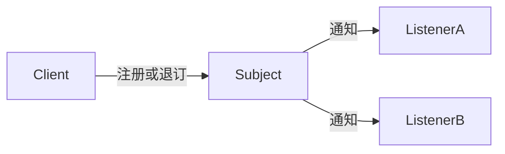

# Go · 观察者（Observer）

[← Go 选择指南](README.md) · [Skill 入口](../../SKILL.md) · [可运行源码](../../examples/go/observer/main.go)

**分类：行为型** · **代码目标：Go 1.20 语法/API 目标；示例不依赖 1.23 range 函数**

> 建立一对多订阅关系，在主题变化时通知感兴趣的观察者。

模式意图基于参考站概念页归纳；工程取舍与示例为本项目新编。 [概念依据](https://refactoringguru.cn/design-patterns/observer) · [来源边界](../../docs/SOURCES.md)

## 问题与动机

事件发生后多个组件要响应，但发布者不该硬编码每个具体接收者。

**本例场景：** 注册回调、发出事件、注销，再确认后续事件不再影响该订阅者。

## 适用与避免

**适用：** 一个对象变化需要通知动态集合的订阅者，订阅生命周期可管理。

**避免：** 需要持久消息、跨进程投递或恰好一次保证，却只有内存回调列表。

## 结构、参与者与协作

下图是角色关系示意，不是要求每种语言建立相同类层次。动态语言的协议角色可由方法约定承担。



| GoF 角色 | 本例对应职责（成员拼写以代码为准） |
|---|---|
| Subject | Events：注册、注销和通知 |
| Observer | 函数/对象回调：接收事件值 |
| Subscription | 订阅 token：供调用方解除注册 |

1. 定义事件载荷，避免让观察者随意窥探发布者。
2. 注册时返回可注销的标识或句柄。
3. 通知时按约定的快照、顺序及错误政策调用观察者。

## Go 实现要点

复制回调列表允许当前回调退订；map 遍历次序未定义，不能承诺订阅顺序。仅单 goroutine，同步执行，回调 panic 会中止传播。

**实现定位：** 可运行的最小教学实现；语言机制与模式意图分别说明。

## 完整示例

以下代码与独立源码文件逐字同步；无需第三方业务依赖。测试只覆盖代码中实际写出的断言。

```go
package main

import (
	"fmt"
)

func check(ok bool) {
	if !ok {
		panic("check failed")
	}
}

type Events struct {
	sequence  int
	listeners map[int]func(int)
}

func NewEvents() *Events { return &Events{listeners: make(map[int]func(int))} }
func (e *Events) Subscribe(fn func(int)) int {
	e.sequence++
	e.listeners[e.sequence] = fn
	return e.sequence
}
func (e *Events) Unsubscribe(id int) { delete(e.listeners, id) }
func (e *Events) Emit(value int) {
	snapshot := make([]func(int), 0, len(e.listeners))
	for _, fn := range e.listeners {
		snapshot = append(snapshot, fn)
	}
	for _, fn := range snapshot {
		fn(value)
	}
}

func main() {
	events := NewEvents()
	seen := []int{}
	id := events.Subscribe(func(n int) { seen = append(seen, n) })
	events.Emit(1)
	events.Unsubscribe(id)
	events.Emit(2)
	check(len(seen) == 1 && seen[0] == 1)
	self := 0
	self = events.Subscribe(func(int) { events.Unsubscribe(self) })
	events.Emit(3)
	events.Emit(4)
	fmt.Println("OK observer")
}
```

## 运行与验证

从仓库根目录执行（先安装对应工具链）：

```sh
go run examples/go/observer/main.go
```

期望标准输出：`OK observer`。任何内嵌断言失败都应导致非零退出；Python 不要使用 `-O` 禁用断言，Swift 不要使用 `-Ounchecked`。

**当前源码状态：已通过编译/运行与内嵌断言。** [完整验证记录](../../docs/VERIFICATION.md)。源码 SHA-256：`89cd0c610be5b2f9a148b079167995c2e7e5e477752ef3c5603b5606a630117f`。

## 收益与代价

**收益**

- 发布者与具体响应者解耦。
- 订阅者可动态增减。

**代价**

- 引用保留可能造成泄漏。
- 顺序、异常和重入会影响通知完整性。

## 工程边界与常见错误

示例是同步、单线程、快照遍历，回调异常按 fail-fast 向上传播；因此不是保证所有订阅者都收到的广播。异步场景需另设计背压、取消、重试与错误隔离。

- 忘记注销长生命周期发布者上的短生命周期订阅。
- 遍历可变订阅容器时允许回调直接破坏迭代。
- 把同步内存回调称为可靠消息队列。

上述工程要求不是运行一次教学示例便能证明的能力；未特别实现的并发访问、外部 I/O、事务、重试与持久化不在本例保证内。

## 扩展测试建议（不等于已全部实现）

- 订阅者收到事件。
- 注销后不再收到后续事件。
- 增加/删除订阅发生在通知中时遵循快照约定。

针对你的真实输入补充边界/错误用例，再检查替换实现是否保持契约。必要时加入并发竞争、生命周期释放、深度/内存上限和回归测试；不要把断言通过当成生产就绪认证。

## 与替代模式比较

**[中介者](mediator.md)：** 观察者负责通知；中介者管理协作规则。

**[责任链](chain-of-responsibility.md)：** 观察者通常通知多个订阅者；责任链按顺序转交并可能提前终止。

## 来源与继续阅读

- [模式概念](https://refactoringguru.cn/design-patterns/observer)
- [Effective Go](https://go.dev/doc/effective_go#interfaces_and_types)
- [sync.Once](https://pkg.go.dev/sync#Once)
- [Go 语言规范](https://go.dev/ref/spec)
- [来源分层、原创范围与未覆盖项](../../docs/SOURCES.md)
