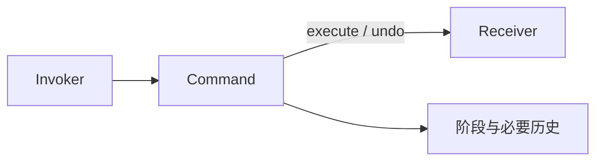

# Java · 命令（Command）

[← Java 选择指南](README.md) · [Skill 入口](../../SKILL.md) · [可运行源码](../../examples/java/command/Main.java)

**分类：行为型** · **代码目标：Java 17（通过 --release 17 约束）**

> 把一次请求、其接收者与执行所需参数封装为独立对象。

模式意图基于参考站概念页归纳；工程取舍与示例为本项目新编。 [概念依据](https://refactoringguru.cn/design-patterns/command) · [来源边界](../../docs/SOURCES.md)

## 问题与动机

按钮或队列不应知道如何修改计数器，同时系统希望记录与撤销一次操作。

**本例场景：** 封装一次 Counter 增量操作，执行后可撤销；错误调用次序被拒绝。

## 适用与避免

**适用：** 需要排队、历史记录、延迟执行、撤销，或将请求传给通用调用器。

**避免：** 调用没有生命周期、历史或排队需求，一个函数已充分表达意图。

## 结构、参与者与协作

下图是角色关系示意，不是要求每种语言建立相同类层次。动态语言的协议角色可由方法约定承担。



| GoF 角色 | 本例对应职责（成员拼写以代码为准） |
|---|---|
| Command | AddCommand：execute / undo |
| Receiver | Counter：持有被修改值 |
| Invoker | 演示调用代码或历史栈：只使用命令接口 |

1. 把接收者和请求参数保存到命令中。
2. 定义执行成功、重复执行与撤销的规则。
3. 调用器只负责调度或历史，不承接接收者业务逻辑。

## Java 实现要点

显式枚举阶段与方法引用便于测试。快照撤销只在无交错写入的演示中有效；排队命令需要独立的序列化、幂等和版本规则。

**实现定位：** 可运行的最小教学实现；语言机制与模式意图分别说明。

## 完整示例

以下代码与独立源码文件逐字同步；无需第三方业务依赖。测试只覆盖代码中实际写出的断言。

```java
import java.util.*;
import java.util.function.*;

public final class Main {
    static final class Counter { int value; }
    enum Phase { NEW, DONE, UNDONE }
    static final class AddCommand {
        private final Counter counter;
        private final int amount;
        private int before;
        private Phase phase = Phase.NEW;
        AddCommand(Counter counter, int amount) { this.counter = counter; this.amount = amount; }
        void execute() {
            if (phase != Phase.NEW) throw new IllegalStateException("already executed");
            before = counter.value;
            counter.value += amount;
            phase = Phase.DONE;
        }
        void undo() {
            if (phase != Phase.DONE) throw new IllegalStateException("nothing to undo");
            counter.value = before;
            phase = Phase.UNDONE;
        }
    }

    static void check(boolean condition) {
        if (!condition) throw new AssertionError("contract failed");
    }
    static void expectThrows(Runnable action) {
        boolean failed = false;
        try { action.run(); } catch (RuntimeException ex) { failed = true; }
        check(failed);
    }

    public static void main(String[] args) {
        var counter = new Counter();
        var command = new AddCommand(counter, 5);
        command.execute();
        check(counter.value == 5);
        expectThrows(command::execute);
        command.undo();
        check(counter.value == 0);
        expectThrows(command::undo);
        System.out.println("OK command");
    }
}
```

## 运行与验证

从仓库根目录执行（先安装对应工具链）：

```sh
cd examples/java/command
javac --release 17 Main.java
java -ea Main
```

期望标准输出：`OK command`。任何内嵌断言失败都应导致非零退出；Python 不要使用 `-O` 禁用断言，Swift 不要使用 `-Ounchecked`。

**当前源码状态：已通过编译/运行与内嵌断言。** [完整验证记录](../../docs/VERIFICATION.md)。源码 SHA-256：`aa8cdb049f7dd5e26cabc60c6b8af8455b17d9304d7698cf6cfddb4f1db5b662`。

## 收益与代价

**收益**

- 请求可作为值被存储与传递。
- 调用器不耦合具体接收者操作。

**代价**

- 撤销不是每个操作都可行。
- 队列化会带来版本、幂等与序列化的独立问题。

## 工程边界与常见错误

本例限制一次 execute/undo，且接收者不被其他操作并发修改。生产历史应使用版本检查、可逆操作或补偿，避免旧快照覆盖后续合法修改。

- 没有成功执行就允许 undo。
- 重放重复扣减等副作用，却没有幂等策略。
- 把内存撤销示例当成生产事务恢复。

上述工程要求不是运行一次教学示例便能证明的能力；未特别实现的并发访问、外部 I/O、事务、重试与持久化不在本例保证内。

## 扩展测试建议（不等于已全部实现）

- 执行使值增加，撤销恢复先前值。
- 重复 execute 或重复 undo 按明确规则拒绝。
- 失败路径不留下伪造的成功历史。

针对你的真实输入补充边界/错误用例，再检查替换实现是否保持契约。必要时加入并发竞争、生命周期释放、深度/内存上限和回归测试；不要把断言通过当成生产就绪认证。

## 与替代模式比较

**[备忘录](memento.md)：** 命令保存做什么；备忘录保存状态，二者可组合支持撤销。

**[策略](strategy.md)：** 命令代表一次请求及其生命周期；策略代表可替换的算法选择。

## 来源与继续阅读

- [模式概念](https://refactoringguru.cn/design-patterns/command)
- [Java 函数式接口](https://docs.oracle.com/en/java/javase/17/docs/api/java.base/java/util/function/package-summary.html)
- [JLS 类初始化](https://docs.oracle.com/javase/specs/jls/se17/html/jls-12.html#jls-12.4.2)
- [来源分层、原创范围与未覆盖项](../../docs/SOURCES.md)
