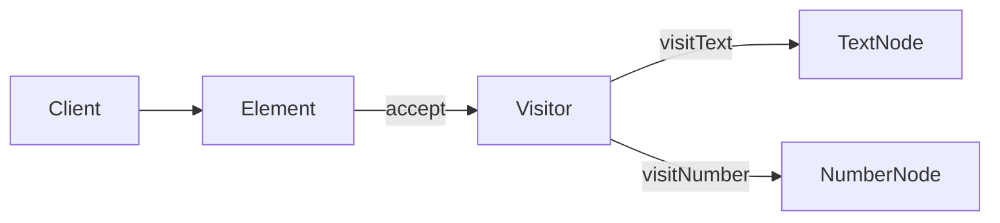

# Java · 访问者（Visitor）

[← Java 选择指南](README.md) · [Skill 入口](../../SKILL.md) · [可运行源码](../../examples/java/visitor/Main.java)

**分类：行为型** · **代码目标：Java 17（通过 --release 17 约束）**

> 把作用于稳定对象结构的操作移到访问者中，通过元素回调分派到具体类型的操作。

模式意图基于参考站概念页归纳；工程取舍与示例为本项目新编。 [概念依据](https://refactoringguru.cn/design-patterns/visitor) · [来源边界](../../docs/SOURCES.md)

## 问题与动机

文本与数值节点结构稳定，但导出、统计等操作不断增加；将所有操作塞进节点类会增加耦合。

**本例场景：** TextNode 与 NumberNode 通过 accept 分派给 RenderVisitor，不使用运行时类型判断链。

## 适用与避免

**适用：** 节点类型集合相对稳定，新增操作比新增节点类型更频繁。

**避免：** 节点类型经常变化，或简单模式匹配已经更清楚。

## 结构、参与者与协作

下图是角色关系示意，不是要求每种语言建立相同类层次。动态语言的协议角色可由方法约定承担。



| GoF 角色 | 本例对应职责（成员拼写以代码为准） |
|---|---|
| Element | Node：accept(visitor) |
| ConcreteElement | TextNode / NumberNode：调用各自的 visit 方法 |
| Visitor | NodeVisitor：声明按元素类型区分的操作 |
| ConcreteVisitor | RenderVisitor：实现一种导出操作 |

1. 确认结构类型稳定，值得为新增操作优化。
2. 元素 accept 调用访问者针对自己的方法，实现明确双分派。
3. 新增操作增加访问者；新增元素时显式更新全部访问者。

## Java 实现要点

元素 accept 回调类型专属方法实现双分派。record 仅表示数据；把新增操作放在访问者中，新增元素时必须更新接口及所有访问者。

**实现定位：** 可运行的最小教学实现；语言机制与模式意图分别说明。

## 完整示例

以下代码与独立源码文件逐字同步；无需第三方业务依赖。测试只覆盖代码中实际写出的断言。

```java
import java.util.*;
import java.util.function.*;

public final class Main {
    interface NodeVisitor {
        String visitText(TextNode node);
        String visitNumber(NumberNode node);
    }
    interface Node { String accept(NodeVisitor visitor); }
    record TextNode(String value) implements Node {
        public String accept(NodeVisitor visitor) { return visitor.visitText(this); }
    }
    record NumberNode(int value) implements Node {
        public String accept(NodeVisitor visitor) { return visitor.visitNumber(this); }
    }
    static final class RenderVisitor implements NodeVisitor {
        public String visitText(TextNode node) { return "text:" + node.value(); }
        public String visitNumber(NumberNode node) { return "number:" + node.value(); }
    }

    static void check(boolean condition) {
        if (!condition) throw new AssertionError("contract failed");
    }
    static void expectThrows(Runnable action) {
        boolean failed = false;
        try { action.run(); } catch (RuntimeException ex) { failed = true; }
        check(failed);
    }

    public static void main(String[] args) {
        var visitor = new RenderVisitor();
        List<Node> nodes = List.of(new TextNode("a"), new NumberNode(7));
        check(nodes.stream().map(node -> node.accept(visitor)).toList().equals(List.of("text:a", "number:7")));
        System.out.println("OK visitor");
    }
}
```

## 运行与验证

从仓库根目录执行（先安装对应工具链）：

```sh
cd examples/java/visitor
javac --release 17 Main.java
java -ea Main
```

期望标准输出：`OK visitor`。任何内嵌断言失败都应导致非零退出；Python 不要使用 `-O` 禁用断言，Swift 不要使用 `-Ounchecked`。

**当前源码状态：已通过编译/运行与内嵌断言。** [完整验证记录](../../docs/VERIFICATION.md)。源码 SHA-256：`5b42ec8e32bfac176812bfdfc91ce3edec35ef676ef0cb7e5e9c5b21c558dd06`。

## 收益与代价

**收益**

- 可在不修改每个节点类的情况下新增操作。
- 与同一种操作相关的逻辑集中。

**代价**

- 增加新节点类型通常要修改所有访问者。
- 访问者可能需要超出元素公开契约的内部信息。

## 工程边界与常见错误

严格双分派不等于必须使用反射。封闭类型集合在 Rust/Kotlin 等语言中也可通过穷尽匹配实现替代；是否采用经典访问者应由扩展方向决定。

- 仅把 runtime instanceof 链挪到另一个类，却没有解释实际分派机制。
- 把 Visitor 称为对新增元素也完全开闭。
- 访问者结果/状态在多个遍历间意外共享。

上述工程要求不是运行一次教学示例便能证明的能力；未特别实现的并发访问、外部 I/O、事务、重试与持久化不在本例保证内。

## 扩展测试建议（不等于已全部实现）

- 不同元素分派到正确的 visit 方法。
- 导出结果符合各类型契约。
- 新增元素时编译或契约测试能提示缺失的访问方法。

针对你的真实输入补充边界/错误用例，再检查替换实现是否保持契约。必要时加入并发竞争、生命周期释放、深度/内存上限和回归测试；不要把断言通过当成生产就绪认证。

## 与替代模式比较

**[迭代器](iterator.md)：** 迭代器决定遍历顺序；访问者决定类型相关操作。

**[解释器](interpreter.md)：** 解释器赋予语法树求值含义；访问者可承载求值、格式化等多个树操作。

## 来源与继续阅读

- [模式概念](https://refactoringguru.cn/design-patterns/visitor)
- [Java 函数式接口](https://docs.oracle.com/en/java/javase/17/docs/api/java.base/java/util/function/package-summary.html)
- [JLS 类初始化](https://docs.oracle.com/javase/specs/jls/se17/html/jls-12.html#jls-12.4.2)
- [来源分层、原创范围与未覆盖项](../../docs/SOURCES.md)
