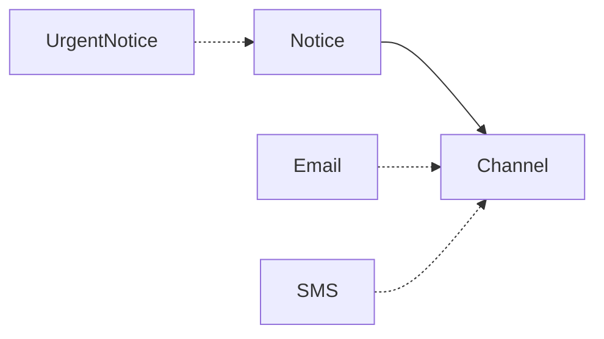

# JavaScript · 桥接（Bridge）

[← JavaScript 选择指南](README.md) · [Skill 入口](../../SKILL.md) · [可运行源码](../../examples/javascript/bridge/main.mjs)

**分类：结构型** · **代码目标：ES2022 / Node.js 18+ 目标**

> 用组合连接抽象与实现，使两个变化维度能够独立扩展。

模式意图基于参考站概念页归纳；工程取舍与示例为本项目新编。 [概念依据](https://refactoringguru.cn/design-patterns/bridge) · [来源边界](../../docs/SOURCES.md)

## 问题与动机

通知有普通与紧急两种形式，发送渠道又有邮件与短信；为每种组合建子类会成倍膨胀。

**本例场景：** 普通或紧急通知可以使用 Email 或 SMS 渠道，展示两个独立维度。

## 适用与避免

**适用：** 产品确实存在两个独立、持续变化的维度，例如消息形式 × 发送渠道。

**避免：** 只有一个变化维度，或所谓第二维只是一个固定实现细节。

## 结构、参与者与协作

下图是角色关系示意，不是要求每种语言建立相同类层次。动态语言的协议角色可由方法约定承担。



| GoF 角色 | 本例对应职责（成员拼写以代码为准） |
|---|---|
| Abstraction | Notice：持有 Channel 并组织消息（未显式声明的接口角色由方法约定承担） |
| RefinedAbstraction | UrgentNotice：改变消息形式（未显式声明的接口角色由方法约定承担） |
| Implementor | Channel：发送接口（未显式声明的接口角色由方法约定承担） |
| ConcreteImplementor | EmailChannel / SmsChannel：渠道实现（未显式声明的接口角色由方法约定承担） |

1. 从变化历史确认两个独立维度。
2. 把底层能力抽为小接口，通过组合注入。
3. 让抽象层在底层能力之上定义自己的业务操作。

## JavaScript 实现要点

ES2022 原创示例，与 TypeScript 版本同源并经过类型擦除；用鸭子类型、类/闭包和显式运行时检查表达契约。编译期 interface 已擦除，集成外部数据时必须保留运行时契约测试。

**实现定位：** 可运行的最小教学实现；语言机制与模式意图分别说明。

## 完整示例

以下代码与独立源码文件逐字同步；无需第三方业务依赖。测试只覆盖代码中实际写出的断言。

```javascript
function check(condition, message = "contract failed") {
    if (!condition)
        throw new Error(message);
}
function expectThrows(action) {
    let failed = false;
    try {
        action();
    }
    catch {
        failed = true;
    }
    check(failed, "expected an error");
}
class EmailChannel {
    send(text) { return "email:" + text; }
}
class SmsChannel {
    send(text) { return "sms:" + text; }
}
class Notice {
    channel;
    constructor(channel) {
        this.channel = channel;
    }
    send(text) { return this.channel.send(text); }
}
class UrgentNotice extends Notice {
    send(text) { return this.channel.send("!" + text); }
}
check(new Notice(new EmailChannel()).send("ready") === "email:ready");
check(new Notice(new SmsChannel()).send("ready") === "sms:ready");
check(new UrgentNotice(new EmailChannel()).send("ready") === "email:!ready");
check(new UrgentNotice(new SmsChannel()).send("ready") === "sms:!ready");
console.log("OK bridge");
export {};
```

## 运行与验证

从仓库根目录执行（先安装对应工具链）：

```sh
node examples/javascript/bridge/main.mjs
```

期望标准输出：`OK bridge`。任何内嵌断言失败都应导致非零退出；Python 不要使用 `-O` 禁用断言，Swift 不要使用 `-Ounchecked`。

**当前源码状态：已通过运行与内嵌断言。** [完整验证记录](../../docs/VERIFICATION.md)。源码 SHA-256：`0ad3a7ebb4bdcf948d61b6a97465c57ea764534e0441aaa75bd7b5db296e7ae0`。

## 收益与代价

**收益**

- 避免组合子类数量爆炸。
- 抽象和底层实现可分别测试、演进。

**代价**

- 多一层委派，初期理解成本更高。
- 过早猜测变化维度可能形成无用接口。

## 工程边界与常见错误

实现对象是否拥有连接、是否可以并发共享，需要在 Channel 契约明确。桥接不等于远程透明，网络错误仍应暴露为业务可处理结果。

- 把所有依赖接口的组合都称为桥接，却没有两个可独立扩展的维度。
- 底层接口泄漏具体渠道细节。
- 运行时换渠道时没有定义在途请求归属。

上述工程要求不是运行一次教学示例便能证明的能力；未特别实现的并发访问、外部 I/O、事务、重试与持久化不在本例保证内。

## 扩展测试建议（不等于已全部实现）

- 普通/紧急消息分别组合两种渠道。
- 新增渠道不改消息形式实现。
- 新增消息形式不修改渠道契约。

针对你的真实输入补充边界/错误用例，再检查替换实现是否保持契约。必要时加入并发竞争、生命周期释放、深度/内存上限和回归测试；不要把断言通过当成生产就绪认证。

## 与替代模式比较

**[适配器](adapter.md)：** 桥接是对两个变化维度的组织；适配器通常用于接合已有不兼容接口。

**[策略](strategy.md)：** 策略通常替换一个算法；桥接强调抽象体系与实现体系的独立演进。

## 来源与继续阅读

- [模式概念](https://refactoringguru.cn/design-patterns/bridge)
- [ECMAScript 标准入口](https://ecma-international.org/publications-and-standards/standards/ecma-262/)
- [JavaScript 迭代协议](https://developer.mozilla.org/en-US/docs/Web/JavaScript/Reference/Iteration_protocols)
- [来源分层、原创范围与未覆盖项](../../docs/SOURCES.md)
