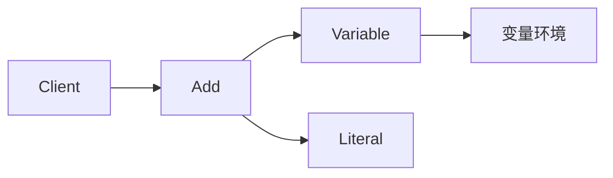

# JavaScript · 解释器（Interpreter）

[← JavaScript 选择指南](README.md) · [Skill 入口](../../SKILL.md) · [可运行源码](../../examples/javascript/interpreter/main.mjs)

**分类：行为型** · **代码目标：ES2022 / Node.js 18+ 目标**

> 用语言的语法结构表示表达式，并在给定上下文中解释其含义。

本页补充 GoF 解释器；用户参考站目录未收录此项。 [概念依据](https://sourcemaking.com/design_patterns/interpreter) · [来源边界](../../docs/SOURCES.md)

## 问题与动机

一组小型规则需要组合变量与常量，而不是执行任意宿主语言代码。

**本例场景：** 只解释受限的 Literal、Variable、Add 三类 AST 节点，不使用 eval。

## 适用与避免

**适用：** 文法小且稳定、表达式可以组成语法树，需要可控的领域规则求值。

**避免：** 语言复杂或不可信输入需要完整解析、资源治理；此时应使用成熟解析器/执行引擎。

## 结构、参与者与协作

下图是角色关系示意，不是要求每种语言建立相同类层次。动态语言的协议角色可由方法约定承担。



| GoF 角色 | 本例对应职责（成员拼写以代码为准） |
|---|---|
| AbstractExpression | Expr：evaluate(context)（未显式声明的接口角色由方法约定承担） |
| TerminalExpression | Literal / Variable：常量与变量（未显式声明的接口角色由方法约定承担） |
| NonterminalExpression | Add：组合子表达式（未显式声明的接口角色由方法约定承担） |
| Context | 变量到值的映射（未显式声明的接口角色由方法约定承担） |

1. 明确文法与变量环境，而不是直接调用 eval。
2. 为终结符和非终结符建立表达式节点。
3. 递归解释 AST，显式处理缺失变量与非法输入。

## JavaScript 实现要点

ES2022 原创示例，与 TypeScript 版本同源并经过类型擦除；用鸭子类型、类/闭包和显式运行时检查表达契约。编译期 interface 已擦除，集成外部数据时必须保留运行时契约测试。

**实现定位：** 可运行的最小教学实现；语言机制与模式意图分别说明。

## 完整示例

以下代码与独立源码文件逐字同步；无需第三方业务依赖。测试只覆盖代码中实际写出的断言。

```javascript
function check(condition, message = "contract failed") {
    if (!condition)
        throw new Error(message);
}
function expectThrows(action) {
    let failed = false;
    try {
        action();
    }
    catch {
        failed = true;
    }
    check(failed, "expected an error");
}
class Literal {
    value;
    constructor(value) {
        this.value = value;
    }
    evaluate(_context) { return this.value; }
}
class Variable {
    name;
    constructor(name) {
        this.name = name;
    }
    evaluate(context) {
        const value = context.get(this.name);
        if (value === undefined)
            throw new Error("missing variable: " + this.name);
        return value;
    }
}
class Add {
    left;
    right;
    constructor(left, right) {
        this.left = left;
        this.right = right;
    }
    evaluate(context) {
        return this.left.evaluate(context) + this.right.evaluate(context);
    }
}
const expr = new Add(new Variable("x"), new Literal(2));
check(expr.evaluate(new Map([["x", 3]])) === 5);
expectThrows(() => expr.evaluate(new Map()));
console.log("OK interpreter");
export {};
```

## 运行与验证

从仓库根目录执行（先安装对应工具链）：

```sh
node examples/javascript/interpreter/main.mjs
```

期望标准输出：`OK interpreter`。任何内嵌断言失败都应导致非零退出；Python 不要使用 `-O` 禁用断言，Swift 不要使用 `-Ounchecked`。

**当前源码状态：已通过运行与内嵌断言。** [完整验证记录](../../docs/VERIFICATION.md)。源码 SHA-256：`270135f3245ed14a5312b41fd64e507dc26fad4f5c92c7b25827b24f5692e150`。

## 收益与代价

**收益**

- 语义可以由小节点组合。
- 容易为受限 DSL 编写独立规则测试。

**代价**

- 文法复杂时节点数量和维护成本增加。
- 解释开销、深度与输入大小必须限制。

## 工程边界与常见错误

这是 GoF 23 的补充项，不在用户参考站的 22 项目录中。示例手工构建 AST，没有字符串解析器，没有沙箱承诺。求值不得反射调用任意业务方法。

- 把直接 eval 用户字符串称为安全解释器。
- 只有 AST 求值却声称已经实现词法分析和解析。
- 递归输入没有深度、时间或资源限制。

上述工程要求不是运行一次教学示例便能证明的能力；未特别实现的并发访问、外部 I/O、事务、重试与持久化不在本例保证内。

## 扩展测试建议（不等于已全部实现）

- x=3 时 Add(Variable(x), Literal(2)) 求值得到 5。
- 缺少变量时明确失败。
- 生产解析器另测优先级、非法 token 和最大深度。

针对你的真实输入补充边界/错误用例，再检查替换实现是否保持契约。必要时加入并发竞争、生命周期释放、深度/内存上限和回归测试；不要把断言通过当成生产就绪认证。

## 与替代模式比较

**[组合](composite.md)：** 表达式 AST 常用组合组织树；解释器为语法节点规定求值含义。

**[访问者](visitor.md)：** 解释器可把求值放在节点中；访问者能把不同树操作移到外部。

## 来源与继续阅读

- [模式概念](https://sourcemaking.com/design_patterns/interpreter)
- [ECMAScript 标准入口](https://ecma-international.org/publications-and-standards/standards/ecma-262/)
- [JavaScript 迭代协议](https://developer.mozilla.org/en-US/docs/Web/JavaScript/Reference/Iteration_protocols)
- [来源分层、原创范围与未覆盖项](../../docs/SOURCES.md)
