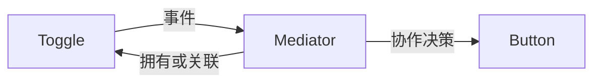

# JavaScript · 中介者（Mediator）

[← JavaScript 选择指南](README.md) · [Skill 入口](../../SKILL.md) · [可运行源码](../../examples/javascript/mediator/main.mjs)

**分类：行为型** · **代码目标：ES2022 / Node.js 18+ 目标**

> 把一组同事对象之间的交互规则集中到协作对象中，避免同事彼此形成网状依赖。

模式意图基于参考站概念页归纳；工程取舍与示例为本项目新编。 [概念依据](https://refactoringguru.cn/design-patterns/mediator) · [来源边界](../../docs/SOURCES.md)

## 问题与动机

表单中的选项改变需要影响提交按钮；让每个控件直接引用其他控件会使规则难以管理。

**本例场景：** Dialog 接收 Toggle 变化并更新 SubmitButton，控件互不引用。

## 适用与避免

**适用：** 多个组件有明确的一组协作规则，需要减少组件间相互引用。

**避免：** 只有简单广播，没有集中决策；或者中介者膨胀到管理整个系统。

## 结构、参与者与协作

下图是角色关系示意，不是要求每种语言建立相同类层次。动态语言的协议角色可由方法约定承担。



| GoF 角色 | 本例对应职责（成员拼写以代码为准） |
|---|---|
| Mediator | Dialog：决定选项与按钮的协作规则（未显式声明的接口角色由方法约定承担） |
| Colleague | Toggle / SubmitButton：只依赖中介事件或自己的职责（未显式声明的接口角色由方法约定承担） |

1. 列出同事间的业务交互，而不是泛化所有通信。
2. 让同事向中介者报告事件，由中介者决定影响谁。
3. 把中介者限制在一个用例或子系统边界。

## JavaScript 实现要点

ES2022 原创示例，与 TypeScript 版本同源并经过类型擦除；用鸭子类型、类/闭包和显式运行时检查表达契约。编译期 interface 已擦除，集成外部数据时必须保留运行时契约测试。

**实现定位：** 可运行的最小教学实现；语言机制与模式意图分别说明。

## 完整示例

以下代码与独立源码文件逐字同步；无需第三方业务依赖。测试只覆盖代码中实际写出的断言。

```javascript
function check(condition, message = "contract failed") {
    if (!condition)
        throw new Error(message);
}
function expectThrows(action) {
    let failed = false;
    try {
        action();
    }
    catch {
        failed = true;
    }
    check(failed, "expected an error");
}
class Toggle {
    changed;
    constructor(changed) {
        this.changed = changed;
    }
    select(value) { this.changed(value); }
}
class SubmitButton {
    enabled = false;
}
class Dialog {
    button = new SubmitButton();
    toggle = new Toggle(selected => this.changed(selected));
    changed(selected) { this.button.enabled = selected; }
}
const dialog = new Dialog();
check(!dialog.button.enabled);
dialog.toggle.select(true);
check(dialog.button.enabled);
dialog.toggle.select(false);
check(!dialog.button.enabled);
console.log("OK mediator");
export {};
```

## 运行与验证

从仓库根目录执行（先安装对应工具链）：

```sh
node examples/javascript/mediator/main.mjs
```

期望标准输出：`OK mediator`。任何内嵌断言失败都应导致非零退出；Python 不要使用 `-O` 禁用断言，Swift 不要使用 `-Ounchecked`。

**当前源码状态：已通过运行与内嵌断言。** [完整验证记录](../../docs/VERIFICATION.md)。源码 SHA-256：`2d32fbc96809aa8c8b2e7dd45b8330bd1a71c3a35befaec70046b469825c33bc`。

## 收益与代价

**收益**

- 组件可复用，不直接依赖其他同事。
- 交互规则集中，便于场景测试。

**代价**

- 中介者可能成为上帝对象。
- 循环事件与隐含顺序会使行为复杂。

## 工程边界与常见错误

UI 回调应在明确执行上下文中触发。闭包和双向持有可能形成保留环；中介者生命周期要与同事一起管理，而不是永久驻留。

- 控件仍直接操作彼此，中介者只是空转发。
- 所有领域逻辑都放进一个全局 EventBus。
- 双向通知形成反馈循环。

上述工程要求不是运行一次教学示例便能证明的能力；未特别实现的并发访问、外部 I/O、事务、重试与持久化不在本例保证内。

## 扩展测试建议（不等于已全部实现）

- 选择变化后提交按钮状态由中介规则更新。
- 同事对象不直接持有其他同事。
- 反向事件不会造成无限反馈。

针对你的真实输入补充边界/错误用例，再检查替换实现是否保持契约。必要时加入并发竞争、生命周期释放、深度/内存上限和回归测试；不要把断言通过当成生产就绪认证。

## 与替代模式比较

**[观察者](observer.md)：** 观察者广播变化；中介者对协作做决策，可在内部使用观察者。

**[外观（门面）](facade.md)：** 外观为外部客户端简化子系统；中介者组织内部同事交互。

## 来源与继续阅读

- [模式概念](https://refactoringguru.cn/design-patterns/mediator)
- [ECMAScript 标准入口](https://ecma-international.org/publications-and-standards/standards/ecma-262/)
- [JavaScript 迭代协议](https://developer.mozilla.org/en-US/docs/Web/JavaScript/Reference/Iteration_protocols)
- [来源分层、原创范围与未覆盖项](../../docs/SOURCES.md)
