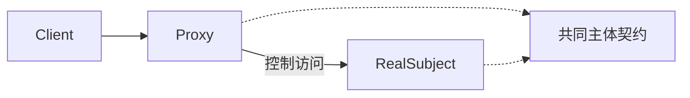

# JavaScript · 代理（Proxy）

[← JavaScript 选择指南](README.md) · [Skill 入口](../../SKILL.md) · [可运行源码](../../examples/javascript/proxy/main.mjs)

**分类：结构型** · **代码目标：ES2022 / Node.js 18+ 目标**

> 提供与主体相同的契约，在访问主体之前或之后实施访问控制或生命周期策略。

模式意图基于参考站概念页归纳；工程取舍与示例为本项目新编。 [概念依据](https://refactoringguru.cn/design-patterns/proxy) · [来源边界](../../docs/SOURCES.md)

## 问题与动机

图像对象昂贵，但并非所有请求都会读取图像；客户端又不应自己管理延迟加载。

**本例场景：** 使用内存计数器观察图像在首次 render 才被创建。

## 适用与避免

**适用：** 需要延迟加载、访问保护、缓存或远程调用边界，且客户端仍面向相同主体契约。

**避免：** 仅为隐藏所有网络成本或失败而宣称远程对象和本地对象完全透明。

## 结构、参与者与协作

下图是角色关系示意，不是要求每种语言建立相同类层次。动态语言的协议角色可由方法约定承担。



| GoF 角色 | 本例对应职责（成员拼写以代码为准） |
|---|---|
| Subject | Image：render 操作（未显式声明的接口角色由方法约定承担） |
| RealSubject | RealImage：实际载入图像的模拟主体（未显式声明的接口角色由方法约定承担） |
| Proxy | ImageProxy：首次访问才创建并缓存主体（未显式声明的接口角色由方法约定承担） |

1. 定义主体契约，保留失败和成本语义。
2. 代理实现同一契约，控制创建或调用时机。
3. 测量主体调用次数，明确缓存和并发的行为。

## JavaScript 实现要点

ES2022 原创示例，与 TypeScript 版本同源并经过类型擦除；用鸭子类型、类/闭包和显式运行时检查表达契约。编译期 interface 已擦除，集成外部数据时必须保留运行时契约测试。

**实现定位：** 可运行的最小教学实现；语言机制与模式意图分别说明。

## 完整示例

以下代码与独立源码文件逐字同步；无需第三方业务依赖。测试只覆盖代码中实际写出的断言。

```javascript
function check(condition, message = "contract failed") {
    if (!condition)
        throw new Error(message);
}
function expectThrows(action) {
    let failed = false;
    try {
        action();
    }
    catch {
        failed = true;
    }
    check(failed, "expected an error");
}
class RealImage {
    render() { return "pixels"; }
}
class ImageProxy {
    #real;
    loads = 0;
    render() {
        if (!this.#real) {
            this.#real = new RealImage();
            this.loads += 1;
        }
        return this.#real.render();
    }
}
const proxy = new ImageProxy();
check(proxy.loads === 0);
check(proxy.render() === "pixels");
check(proxy.render() === "pixels");
check(proxy.loads === 1);
console.log("OK proxy");
export {};
```

## 运行与验证

从仓库根目录执行（先安装对应工具链）：

```sh
node examples/javascript/proxy/main.mjs
```

期望标准输出：`OK proxy`。任何内嵌断言失败都应导致非零退出；Python 不要使用 `-O` 禁用断言，Swift 不要使用 `-Ounchecked`。

**当前源码状态：已通过运行与内嵌断言。** [完整验证记录](../../docs/VERIFICATION.md)。源码 SHA-256：`4ab0740859397bd035b811ad3c83bcab16c9793cbafd78b652670da7a4bc0a62`。

## 收益与代价

**收益**

- 把访问与生命周期策略从业务调用方分离。
- 可以替换昂贵主体用于测试。

**代价**

- 存在隐含延迟、额外状态或远程失败。
- 缓存失效与权限变更会增加复杂度。

## 工程边界与常见错误

本例只展示虚拟代理，不是安全代理或分布式 RPC 实现。线程安全延迟创建、取消、超时、缓存失效需要根据实际环境另设计。

- 代理和主体的接口逐渐不兼容。
- 缓存敏感响应却未纳入身份或权限键。
- 并发首次访问重复创建主体。

上述工程要求不是运行一次教学示例便能证明的能力；未特别实现的并发访问、外部 I/O、事务、重试与持久化不在本例保证内。

## 扩展测试建议（不等于已全部实现）

- 构造代理时尚未载入主体。
- 两次 render 只触发一次主体创建。
- 生产场景另测失败后是否重试和并发首次访问。

针对你的真实输入补充边界/错误用例，再检查替换实现是否保持契约。必要时加入并发竞争、生命周期释放、深度/内存上限和回归测试；不要把断言通过当成生产就绪认证。

## 与替代模式比较

**[装饰](decorator.md)：** 代理控制访问，装饰叠加责任；结构相似时按意图而非类名判断。

**[外观（门面）](facade.md)：** 代理保持主体契约；外观提供简化后的子系统接口。

## 来源与继续阅读

- [模式概念](https://refactoringguru.cn/design-patterns/proxy)
- [ECMAScript 标准入口](https://ecma-international.org/publications-and-standards/standards/ecma-262/)
- [JavaScript 迭代协议](https://developer.mozilla.org/en-US/docs/Web/JavaScript/Reference/Iteration_protocols)
- [来源分层、原创范围与未覆盖项](../../docs/SOURCES.md)
