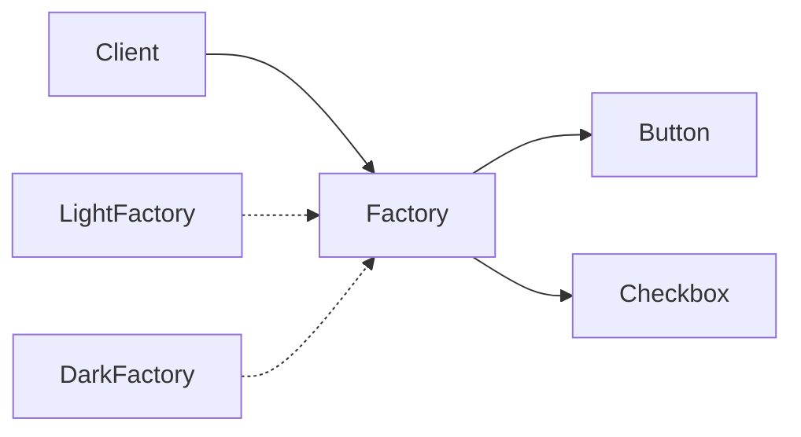

# Kotlin · 抽象工厂（Abstract Factory）

[← Kotlin 选择指南](README.md) · [Skill 入口](../../SKILL.md) · [可运行源码](../../examples/kotlin/abstract-factory/Main.kt)

**分类：创建型** · **代码目标：Kotlin 1.9 / JVM target 17**

> 以一个工厂契约创建多种相关产品，使客户端能够整体替换兼容的产品族。

模式意图基于参考站概念页归纳；工程取舍与示例为本项目新编。 [概念依据](https://refactoringguru.cn/design-patterns/abstract-factory) · [来源边界](../../docs/SOURCES.md)

## 问题与动机

按钮和选择框需要保持相同主题；分别选择实现容易混搭，而客户端不应了解每种主题的具体类型。

**本例场景：** 创建浅色与深色两族 Button / Checkbox，客户端只调用产品契约。

## 适用与避免

**适用：** 需要切换主题、平台、协议家族，且一个家族包含多种必须配套的产品。

**避免：** 只有一个产品种类，或者产品之间不需要兼容约束。

## 结构、参与者与协作

下图是角色关系示意，不是要求每种语言建立相同类层次。动态语言的协议角色可由方法约定承担。



| GoF 角色 | 本例对应职责（成员拼写以代码为准） |
|---|---|
| AbstractFactory | WidgetFactory：button 与 checkbox 两个创建操作 |
| ConcreteFactory | LightFactory / DarkFactory：两个产品族 |
| AbstractProduct | Button / Checkbox：不同产品种类 |
| ConcreteProduct | 各主题对应的按钮与选择框实现 |

1. 先列出产品种类与产品族这两个维度。
2. 每种产品定义自己的接口，工厂接口提供对应创建操作。
3. 客户端只接收一个工厂；在组合根统一选择产品族。

## Kotlin 实现要点

用接口区分产品种类，以工厂保证同主题创建。Kotlin object 可表达无状态工厂；这里保留实例以便展示运行时注入与替换。

**实现定位：** 可运行的最小教学实现；语言机制与模式意图分别说明。

## 完整示例

以下代码与独立源码文件逐字同步；无需第三方业务依赖。测试只覆盖代码中实际写出的断言。

```kotlin
package patterns.abstract_factory

fun expectError(action: () -> Unit) {
    var failed = false
    try { action() } catch (_: RuntimeException) { failed = true }
    check(failed)
}

interface Button { fun draw(): String }
interface Checkbox { fun mark(): String }
class ThemedButton(private val theme: String) : Button { override fun draw() = "$theme:button" }
class ThemedCheckbox(private val theme: String) : Checkbox { override fun mark() = "$theme:checkbox" }
interface WidgetFactory { fun button(): Button; fun checkbox(): Checkbox }
class LightFactory : WidgetFactory {
    override fun button(): Button = ThemedButton("light")
    override fun checkbox(): Checkbox = ThemedCheckbox("light")
}
class DarkFactory : WidgetFactory {
    override fun button(): Button = ThemedButton("dark")
    override fun checkbox(): Checkbox = ThemedCheckbox("dark")
}
fun screen(f: WidgetFactory) = "${f.button().draw()}/${f.checkbox().mark()}"

fun main() {
    check(screen(LightFactory()) == "light:button/light:checkbox")
    check(screen(DarkFactory()) == "dark:button/dark:checkbox")
    println("OK abstract-factory")
}
```

## 运行与验证

从仓库根目录执行（先安装对应工具链）：

```sh
cd examples/kotlin/abstract-factory
kotlinc Main.kt -jvm-target 17 -include-runtime -d demo.jar
java -jar demo.jar
```

期望标准输出：`OK abstract-factory`。任何内嵌断言失败都应导致非零退出；Python 不要使用 `-O` 禁用断言，Swift 不要使用 `-Ounchecked`。

**当前源码状态：已通过编译/运行与内嵌断言。** [完整验证记录](../../docs/VERIFICATION.md)。源码 SHA-256：`39e42e3a118a082a3da10deda238a5f3ce5fd6db09284f1e6e95ae522944a832`。

## 收益与代价

**收益**

- 避免客户端散落具体平台类。
- 把产品族切换集中在一个边界。

**代价**

- 增加新产品族较容易；增加新的产品种类通常要改所有工厂。
- 接口只提供组织边界，不自动证明所有业务兼容约束。

## 工程边界与常见错误

共享有状态工厂需定义线程安全；产品的释放责任不会因工厂模式而消失。不要把每个产品都自动做成单例。

- 只返回一类产品，却称为抽象工厂。
- 绕开工厂直接 new 另一主题的产品。
- 把家族兼容性当作所有语言都会自动静态保证的属性。

上述工程要求不是运行一次教学示例便能证明的能力；未特别实现的并发访问、外部 I/O、事务、重试与持久化不在本例保证内。

## 扩展测试建议（不等于已全部实现）

- 分别创建两个产品族，并验证每族的两类产品风格一致。
- 客户端逻辑不需要区分具体工厂。
- 需要强类型家族约束时额外添加类型级或契约测试。

针对你的真实输入补充边界/错误用例，再检查替换实现是否保持契约。必要时加入并发竞争、生命周期释放、深度/内存上限和回归测试；不要把断言通过当成生产就绪认证。

## 与替代模式比较

**[工厂方法](factory-method.md)：** 抽象工厂面向多种产品组成的族，可由多个工厂方法实现。

**[桥接](bridge.md)：** 桥接隔离两个可独立变化的行为维度；抽象工厂负责选择并创建对象族。

## 来源与继续阅读

- [模式概念](https://refactoringguru.cn/design-patterns/abstract-factory)
- [Kotlin delegation](https://kotlinlang.org/docs/delegation.html)
- [Kotlin object declarations](https://kotlinlang.org/docs/object-declarations.html)
- [Kotlin delegated properties / lazy](https://kotlinlang.org/docs/delegated-properties.html)
- [来源分层、原创范围与未覆盖项](../../docs/SOURCES.md)
