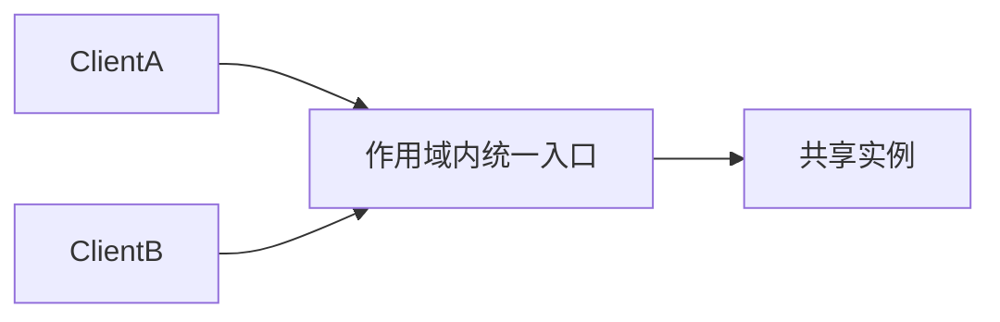

# Kotlin · 单例（Singleton）

[← Kotlin 选择指南](README.md) · [Skill 入口](../../SKILL.md) · [可运行源码](../../examples/kotlin/singleton/Main.kt)

**分类：创建型** · **代码目标：Kotlin 1.9 / JVM target 17**

> 在明确的运行范围内控制实例数量，并提供统一的访问入口。

模式意图基于参考站概念页归纳；工程取舍与示例为本项目新编。 [概念依据](https://refactoringguru.cn/design-patterns/singleton) · [来源边界](../../docs/SOURCES.md)

## 问题与动机

某些只读配置需要共享，但把任意服务做成全局对象会掩盖依赖与生命周期。

**本例场景：** 共享只读 Settings；示例不把连接池、可变缓存或业务上下文塞进全局实例。

## 适用与避免

**适用：** 确有唯一实例约束的进程内只读配置或协调对象，且其边界已被证明。

**避免：** 只是为了方便调用；需要按租户、请求、测试隔离，或实际上应该使用依赖注入。

## 结构、参与者与协作

下图是角色关系示意，不是要求每种语言建立相同类层次。动态语言的协议角色可由方法约定承担。



| GoF 角色 | 本例对应职责（成员拼写以代码为准） |
|---|---|
| Singleton | Settings：受控构造和统一实例访问 |
| Client | 两次取实例，验证同一性与只读配置 |

1. 先定义唯一性范围：模块、进程、类加载器或容器，而不是整个分布式系统。
2. 用语言提供的安全初始化机制，避免手写有竞态的检查再创建。
3. 尽量保存不可变状态，将可变业务服务显式注入。

## Kotlin 实现要点

object 声明表达单例；本包执行基线为 Kotlin/JVM，不把 JVM 的初始化保证推广为任意平台的所有并发语义。val 配置不提供全局可变状态的同步方案。

**实现定位：** 可运行的最小教学实现；语言机制与模式意图分别说明。

## 完整示例

以下代码与独立源码文件逐字同步；无需第三方业务依赖。测试只覆盖代码中实际写出的断言。

```kotlin
package patterns.singleton

fun expectError(action: () -> Unit) {
    var failed = false
    try { action() } catch (_: RuntimeException) { failed = true }
    check(failed)
}

object Settings { val mode: String = "demo" }

fun main() {
    val a = Settings
    val b = Settings
    check(a === b && a.mode == "demo")
    println("OK singleton")
}
```

## 运行与验证

从仓库根目录执行（先安装对应工具链）：

```sh
cd examples/kotlin/singleton
kotlinc Main.kt -jvm-target 17 -include-runtime -d demo.jar
java -jar demo.jar
```

期望标准输出：`OK singleton`。任何内嵌断言失败都应导致非零退出；Python 不要使用 `-O` 禁用断言，Swift 不要使用 `-Ounchecked`。

**当前源码状态：已通过编译/运行与内嵌断言。** [完整验证记录](../../docs/VERIFICATION.md)。源码 SHA-256：`4355c74b753699556d2e953c63a94a9a022525a6ba1f211b9c307305b9c17cc5`。

## 收益与代价

**收益**

- 对确有唯一性约束的资源提供单一入口。
- 安全发布只读配置时实现简单。

**代价**

- 全局依赖与状态会损害测试隔离。
- 初始化安全不代表实例的方法或可变成员线程安全。

## 工程边界与常见错误

示例验证单次运行的身份，不证明集群唯一性。模块级单例是约定表达，不强行声称禁止所有构造途径。并发服务优先显式注入，并由组合根决定单例作用域。

- 声称进程内单例可以跨进程或跨机器唯一。
- 手写不安全的 double-checked locking。
- 把反射、序列化、热重载或多模块副本的边界隐藏起来。

上述工程要求不是运行一次教学示例便能证明的能力；未特别实现的并发访问、外部 I/O、事务、重试与持久化不在本例保证内。

## 扩展测试建议（不等于已全部实现）

- 同一运行范围内两次取值得到相同实例。
- 配置值符合预期且没有业务可变状态。
- 生产要求并发初始化时另做并发与生命周期测试。

针对你的真实输入补充边界/错误用例，再检查替换实现是否保持契约。必要时加入并发竞争、生命周期释放、深度/内存上限和回归测试；不要把断言通过当成生产就绪认证。

## 与替代模式比较

**[享元](flyweight.md)：** 单例控制特定对象的唯一性；享元按键共享一组不同的不可变对象。

**[抽象工厂](abstract-factory.md)：** 工厂负责创建策略，不意味着工厂或其产品必须是单例。

## 来源与继续阅读

- [模式概念](https://refactoringguru.cn/design-patterns/singleton)
- [Kotlin delegation](https://kotlinlang.org/docs/delegation.html)
- [Kotlin object declarations](https://kotlinlang.org/docs/object-declarations.html)
- [Kotlin delegated properties / lazy](https://kotlinlang.org/docs/delegated-properties.html)
- [来源分层、原创范围与未覆盖项](../../docs/SOURCES.md)
