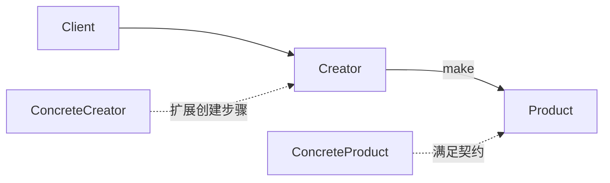

# Ruby · 工厂方法（Factory Method）

[← Ruby 选择指南](README.md) · [Skill 入口](../../SKILL.md) · [可运行源码](../../examples/ruby/factory-method/main.rb)

**分类：创建型** · **代码目标：Ruby 3.1+ 目标**

> 把创建产品的扩展点留给具体创建者，让稳定业务流程只依赖产品契约。

模式意图基于参考站概念页归纳；工程取舍与示例为本项目新编。 [概念依据](https://refactoringguru.cn/design-patterns/factory-method) · [来源边界](../../docs/SOURCES.md)

## 问题与动机

发布流程是稳定的，但输出对象随渠道改变；直接在流程里构造具体产品会把两种变化绑在一起。

**本例场景：** 同一发布流程可生成纯文本或 JSON 风格的教学输出。

## 适用与避免

**适用：** 框架已经有创建者扩展点，需要让扩展实现决定具体产品。

**避免：** 只有一个稳定构造函数，或一个配置到构造函数的映射已经足够。不要为了一个 new 增加整套继承树。

## 结构、参与者与协作

下图是角色关系示意，不是要求每种语言建立相同类层次。动态语言的协议角色可由方法约定承担。



| GoF 角色 | 本例对应职责（成员拼写以代码为准） |
|---|---|
| Product | Renderer：约定 render 行为（未显式声明的接口角色由方法约定承担） |
| ConcreteProduct | PlainRenderer / JsonRenderer：不同输出实现（未显式声明的接口角色由方法约定承担） |
| Creator | Publisher：发布流程调用 make（未显式声明的接口角色由方法约定承担） |
| ConcreteCreator | PlainPublisher / JsonPublisher：覆盖创建步骤（未显式声明的接口角色由方法约定承担） |

1. 先定义客户端真正需要的产品操作，不让它依赖具体类型。
2. 在稳定业务流程内部调用可替换的创建方法。
3. 用具体创建者提供产品；扩展新产品时验证原流程不变。

## Ruby 实现要点

鸭子类型产品只需响应 render；创建者的 protected make 保留继承扩展点。Ruby 没有原生 final，稳定模板依赖约定与测试。

**实现定位：** 可运行的最小教学实现；语言机制与模式意图分别说明。

## 完整示例

以下代码与独立源码文件逐字同步；无需第三方业务依赖。测试只覆盖代码中实际写出的断言。

```ruby
# frozen_string_literal: true

def check(condition)
  raise 'check failed' unless condition
end

def expect_error
  failed = false
  begin
    yield
  rescue StandardError
    failed = true
  end
  check(failed)
end

class PlainRenderer
  def render = 'plain'
end
class JsonRenderer
  def render = 'json'
end
class Publisher
  def publish = "published:#{make.render}"
  protected
  def make = raise(NotImplementedError, 'implement make')
end
class PlainPublisher < Publisher
  protected
  def make = PlainRenderer.new
end
class JsonPublisher < Publisher
  protected
  def make = JsonRenderer.new
end

check(PlainPublisher.new.publish == 'published:plain')
check(JsonPublisher.new.publish == 'published:json')
puts "OK factory-method"
```

## 运行与验证

从仓库根目录执行（先安装对应工具链）：

```sh
ruby examples/ruby/factory-method/main.rb
```

期望标准输出：`OK factory-method`。任何内嵌断言失败都应导致非零退出；Python 不要使用 `-O` 禁用断言，Swift 不要使用 `-Ounchecked`。

**当前源码状态：已通过运行与内嵌断言。** [完整验证记录](../../docs/VERIFICATION.md)。源码 SHA-256：`87ee793a9bc5cc73cd9684f125345d3e94a9ffb4b7e5034745c625adb108d781`。

## 收益与代价

**收益**

- 产品构造与使用分离，扩展点明确。
- 产品及创建者可独立替换以便测试。

**代价**

- 需要额外创建者类型；滥用会产生平行继承层次。
- 配置选择仍需位于组合根，模式不会自动消除所有分支。

## 工程边界与常见错误

工厂创建新对象、返回缓存还是从池中借用，必须写进生命周期契约。创建失败不要把半成品暴露给调用方。Go/Rust 无类继承，示例明确采用组合或 trait 的适配表达，不把普通命名构造函数冒充经典结构。

- 把任何 static create 或 switch 工厂都称为经典工厂方法。
- 工厂返回具体产品类型，导致客户端再次耦合。
- 在构造函数内调用可覆写方法，暴露未初始化对象。

上述工程要求不是运行一次教学示例便能证明的能力；未特别实现的并发访问、外部 I/O、事务、重试与持久化不在本例保证内。

## 扩展测试建议（不等于已全部实现）

- 两种创建者走同一发布流程，产出各自产品的结果。
- 返回的对象满足同一产品契约。
- 新增产品只需扩展具体创建者，不更改发布算法。

针对你的真实输入补充边界/错误用例，再检查替换实现是否保持契约。必要时加入并发竞争、生命周期释放、深度/内存上限和回归测试；不要把断言通过当成生产就绪认证。

## 与替代模式比较

**[抽象工厂](abstract-factory.md)：** 工厂方法提供产品创建扩展点；抽象工厂切换一整族相互兼容的产品。

**[生成器（建造者）](builder.md)：** 工厂方法决定产品实现；生成器管理分步装配和有效性。

## 来源与继续阅读

- [模式概念](https://refactoringguru.cn/design-patterns/factory-method)
- [Ruby Enumerable](https://docs.ruby-lang.org/en/master/Enumerable.html)
- [Ruby Singleton](https://docs.ruby-lang.org/en/master/Singleton.html)
- [来源分层、原创范围与未覆盖项](../../docs/SOURCES.md)
