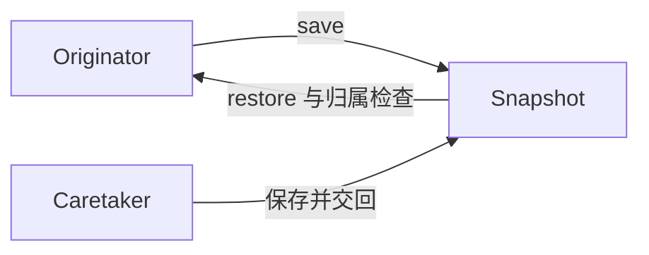

# Ruby · 备忘录（Memento）

[← Ruby 选择指南](README.md) · [Skill 入口](../../SKILL.md) · [可运行源码](../../examples/ruby/memento/main.rb)

**分类：行为型** · **代码目标：Ruby 3.1+ 目标**

> 由原发器创建并解释不透明快照，让外部保存者无需暴露内部状态就能保存与恢复。

模式意图基于参考站概念页归纳；工程取舍与示例为本项目新编。 [概念依据](https://refactoringguru.cn/design-patterns/memento) · [来源边界](../../docs/SOURCES.md)

## 问题与动机

编辑器要保存历史，但历史栈不应该知道文本与内部状态如何表示。

**本例场景：** Editor 保存不透明 Snapshot；编辑后恢复，并拒绝另一编辑器的快照。

## 适用与避免

**适用：** 需要撤销、检查点或恢复，且快照大小与敏感信息可控。

**避免：** 状态巨大或包含不可恢复的外部副作用；不能把快照当成分布式事务。

## 结构、参与者与协作

下图是角色关系示意，不是要求每种语言建立相同类层次。动态语言的协议角色可由方法约定承担。



| GoF 角色 | 本例对应职责（成员拼写以代码为准） |
|---|---|
| Originator | Editor：创建和恢复快照（未显式声明的接口角色由方法约定承担） |
| Memento | Snapshot：保存状态与所属原发器标识（未显式声明的接口角色由方法约定承担） |
| Caretaker | 演示历史变量：只保存并交回 Snapshot（未显式声明的接口角色由方法约定承担） |

1. 让原发器定义快照内容，不由外部窥探字段。
2. 使用不可变或独立复制状态，防止历史被后续编辑改变。
3. 恢复时验证归属与必要的版本，不解释来自任意对象的快照。

## Ruby 实现要点

文本复制加冻结保护快照，恢复时再复制避免编辑改到历史。Ruby 反射可访问实例变量，封装是 API 约定而非敌对代码安全边界。

**实现定位：** 可运行的最小教学实现；语言机制与模式意图分别说明。

## 完整示例

以下代码与独立源码文件逐字同步；无需第三方业务依赖。测试只覆盖代码中实际写出的断言。

```ruby
# frozen_string_literal: true

def check(condition)
  raise 'check failed' unless condition
end

def expect_error
  failed = false
  begin
    yield
  rescue StandardError
    failed = true
  end
  check(failed)
end

class Snapshot
  def initialize(owner, text)
    @owner, @text = owner, text.dup.freeze
    freeze
  end
  def read_for(owner)
    raise ArgumentError, 'foreign snapshot' unless @owner.equal?(owner)
    @text
  end
end
class Editor
  attr_accessor :text
  def initialize
    @owner, @text = Object.new.freeze, ''
  end
  def initialize_copy(_other) = raise(TypeError, 'editor identity cannot be copied')
  def save = Snapshot.new(@owner, @text)
  def restore(snapshot) = @text = snapshot.read_for(@owner).dup
end

a, b = Editor.new, Editor.new
a.text = 'one'; saved = a.save; a.text = 'two'
a.restore(saved); check(a.text == 'one')
a.text.replace('edited'); a.restore(saved); check(a.text == 'one')
expect_error { b.restore(saved) }
puts "OK memento"
```

## 运行与验证

从仓库根目录执行（先安装对应工具链）：

```sh
ruby examples/ruby/memento/main.rb
```

期望标准输出：`OK memento`。任何内嵌断言失败都应导致非零退出；Python 不要使用 `-O` 禁用断言，Swift 不要使用 `-Ounchecked`。

**当前源码状态：已通过运行与内嵌断言。** [完整验证记录](../../docs/VERIFICATION.md)。源码 SHA-256：`40dd6849bd0f66720a5bd573fa0bc1ee61540f45db5ea37bbe467d0a163ea370`。

## 收益与代价

**收益**

- 历史保存者不依赖内部状态布局。
- 支持恢复而不把状态变成公开 API。

**代价**

- 快照会消耗内存和持久化空间。
- 保存敏感数据、版本迁移与恢复时机都需要额外策略。

## 工程边界与常见错误

动态语言的封装依赖约定时会明确说明，不声称私有字段是安全边界。示例只有内存文本；持久化快照需设版本、访问控制、保留周期和完整性验证。

- 外部保存者直接修改快照内部状态。
- 浅复制导致历史也随当前内容变化。
- 把别的对象的快照交给当前对象恢复。

上述工程要求不是运行一次教学示例便能证明的能力；未特别实现的并发访问、外部 I/O、事务、重试与持久化不在本例保证内。

## 扩展测试建议（不等于已全部实现）

- 编辑后恢复得到原来的内容。
- 历史快照不受后续编辑影响。
- 不属于当前原发器的快照被拒绝。

针对你的真实输入补充边界/错误用例，再检查替换实现是否保持契约。必要时加入并发竞争、生命周期释放、深度/内存上限和回归测试；不要把断言通过当成生产就绪认证。

## 与替代模式比较

**[原型](prototype.md)：** 备忘录恢复原发器；原型创建另一个实例。

**[命令](command.md)：** 命令表示操作；备忘录保存状态，可作为命令撤销机制。

## 来源与继续阅读

- [模式概念](https://refactoringguru.cn/design-patterns/memento)
- [Ruby Enumerable](https://docs.ruby-lang.org/en/master/Enumerable.html)
- [Ruby Singleton](https://docs.ruby-lang.org/en/master/Singleton.html)
- [来源分层、原创范围与未覆盖项](../../docs/SOURCES.md)
