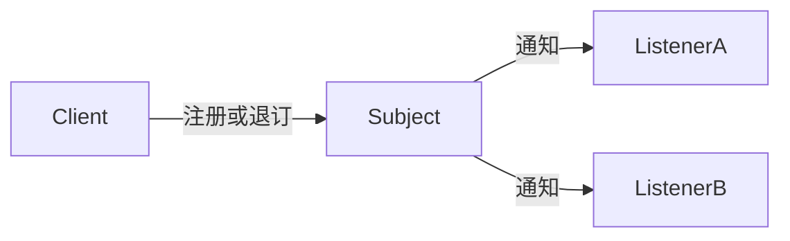

# Ruby · 观察者（Observer）

[← Ruby 选择指南](README.md) · [Skill 入口](../../SKILL.md) · [可运行源码](../../examples/ruby/observer/main.rb)

**分类：行为型** · **代码目标：Ruby 3.1+ 目标**

> 建立一对多订阅关系，在主题变化时通知感兴趣的观察者。

模式意图基于参考站概念页归纳；工程取舍与示例为本项目新编。 [概念依据](https://refactoringguru.cn/design-patterns/observer) · [来源边界](../../docs/SOURCES.md)

## 问题与动机

事件发生后多个组件要响应，但发布者不该硬编码每个具体接收者。

**本例场景：** 注册回调、发出事件、注销，再确认后续事件不再影响该订阅者。

## 适用与避免

**适用：** 一个对象变化需要通知动态集合的订阅者，订阅生命周期可管理。

**避免：** 需要持久消息、跨进程投递或恰好一次保证，却只有内存回调列表。

## 结构、参与者与协作

下图是角色关系示意，不是要求每种语言建立相同类层次。动态语言的协议角色可由方法约定承担。



| GoF 角色 | 本例对应职责（成员拼写以代码为准） |
|---|---|
| Subject | Events：注册、注销和通知（未显式声明的接口角色由方法约定承担） |
| Observer | 函数/对象回调：接收事件值（未显式声明的接口角色由方法约定承担） |
| Subscription | 订阅 token：供调用方解除注册（未显式声明的接口角色由方法约定承担） |

1. 定义事件载荷，避免让观察者随意窥探发布者。
2. 注册时返回可注销的标识或句柄。
3. 通知时按约定的快照、顺序及错误政策调用观察者。

## Ruby 实现要点

Hash#values 返回本轮回调数组快照，允许回调自退订；订阅需要 block。同步异常向上传播，无线程隔离、持久投递与异步背压。

**实现定位：** 可运行的最小教学实现；语言机制与模式意图分别说明。

## 完整示例

以下代码与独立源码文件逐字同步；无需第三方业务依赖。测试只覆盖代码中实际写出的断言。

```ruby
# frozen_string_literal: true

def check(condition)
  raise 'check failed' unless condition
end

def expect_error
  failed = false
  begin
    yield
  rescue StandardError
    failed = true
  end
  check(failed)
end

class Events
  def initialize
    @sequence, @listeners = 0, {}
  end
  def subscribe(&listener)
    raise ArgumentError, 'listener required' unless listener
    @sequence += 1
    @listeners[@sequence] = listener
    @sequence
  end
  def unsubscribe(token) = @listeners.delete(token)
  def emit(value) = @listeners.values.each { |listener| listener.call(value) }
end

events, seen = Events.new, []
token = events.subscribe { |n| seen << n }
events.emit(1); events.unsubscribe(token); events.emit(2)
check(seen == [1])
self_token = nil
self_token = events.subscribe { |_n| events.unsubscribe(self_token) }
events.emit(3); events.emit(4)
puts "OK observer"
```

## 运行与验证

从仓库根目录执行（先安装对应工具链）：

```sh
ruby examples/ruby/observer/main.rb
```

期望标准输出：`OK observer`。任何内嵌断言失败都应导致非零退出；Python 不要使用 `-O` 禁用断言，Swift 不要使用 `-Ounchecked`。

**当前源码状态：已通过运行与内嵌断言。** [完整验证记录](../../docs/VERIFICATION.md)。源码 SHA-256：`15136ae02b94efc0e808760255c74e5b545abed83163264ecef8887dac1cc675`。

## 收益与代价

**收益**

- 发布者与具体响应者解耦。
- 订阅者可动态增减。

**代价**

- 引用保留可能造成泄漏。
- 顺序、异常和重入会影响通知完整性。

## 工程边界与常见错误

示例是同步、单线程、快照遍历，回调异常按 fail-fast 向上传播；因此不是保证所有订阅者都收到的广播。异步场景需另设计背压、取消、重试与错误隔离。

- 忘记注销长生命周期发布者上的短生命周期订阅。
- 遍历可变订阅容器时允许回调直接破坏迭代。
- 把同步内存回调称为可靠消息队列。

上述工程要求不是运行一次教学示例便能证明的能力；未特别实现的并发访问、外部 I/O、事务、重试与持久化不在本例保证内。

## 扩展测试建议（不等于已全部实现）

- 订阅者收到事件。
- 注销后不再收到后续事件。
- 增加/删除订阅发生在通知中时遵循快照约定。

针对你的真实输入补充边界/错误用例，再检查替换实现是否保持契约。必要时加入并发竞争、生命周期释放、深度/内存上限和回归测试；不要把断言通过当成生产就绪认证。

## 与替代模式比较

**[中介者](mediator.md)：** 观察者负责通知；中介者管理协作规则。

**[责任链](chain-of-responsibility.md)：** 观察者通常通知多个订阅者；责任链按顺序转交并可能提前终止。

## 来源与继续阅读

- [模式概念](https://refactoringguru.cn/design-patterns/observer)
- [Ruby Enumerable](https://docs.ruby-lang.org/en/master/Enumerable.html)
- [Ruby Singleton](https://docs.ruby-lang.org/en/master/Singleton.html)
- [来源分层、原创范围与未覆盖项](../../docs/SOURCES.md)
