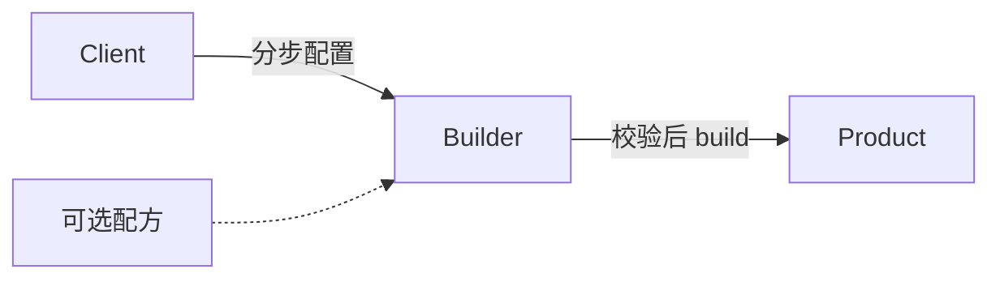

# Rust · 生成器（建造者）（Builder）

[← Rust 选择指南](README.md) · [Skill 入口](../../SKILL.md) · [可运行源码](../../examples/rust/builder/main.rs)

**分类：创建型** · **代码目标：Rust 1.70 / edition 2021**

> 把复杂对象的分步组装与最终表示分开，在完成边界建立对象不变量。

模式意图基于参考站概念页归纳；工程取舍与示例为本项目新编。 [概念依据](https://refactoringguru.cn/design-patterns/builder) · [来源边界](../../docs/SOURCES.md)

## 问题与动机

报告包含标题和多个章节；巨大构造函数难读，直接暴露可变组装过程又会让客户端拿到无效对象。

**本例场景：** 构建带标题和章节列表的报告，在 build 时检查标题非空。

## 适用与避免

**适用：** 有多步骤、可选字段、跨字段校验，或需要用相同组装过程产出不同表示。

**避免：** 少量必填参数可由清晰构造函数、命名参数或不可变记录解决。

## 结构、参与者与协作

下图是角色关系示意，不是要求每种语言建立相同类层次。动态语言的协议角色可由方法约定承担。



| GoF 角色 | 本例对应职责（成员拼写以代码为准） |
|---|---|
| Builder | ReportBuilder：积累标题和章节并 build |
| Product | Report：完成后的报告快照 |
| Director | 可选的配方/调用代码：决定组装次序，本例不另设类 |

1. 把构建期状态与最终产品分开。
2. 提供表达领域动作的方法，而不是无约束 setter 集合。
3. 在 build 校验必需状态，再复制或转移所有权形成产品。

## Rust 实现要点

可变借用链式配置，build 克隆拥有的 String/Vec 形成独立快照。消耗 self 的建造器可避免复制，类型状态建造器可增强约束；代价与 API 复杂度不同。

**实现定位：** 可运行的最小教学实现；语言机制与模式意图分别说明。

## 完整示例

以下代码与独立源码文件逐字同步；无需第三方业务依赖。测试只覆盖代码中实际写出的断言。

```rust
#[derive(Debug)]
struct Report { title: String, sections: Vec<String> }
#[derive(Default)]
struct ReportBuilder { title: String, sections: Vec<String> }
impl ReportBuilder {
    fn title(&mut self, value: &str) -> &mut Self { self.title = value.trim().to_owned(); self }
    fn section(&mut self, value: &str) -> &mut Self { self.sections.push(value.to_owned()); self }
    fn build(&self) -> Result<Report, &'static str> {
        if self.title.is_empty() { return Err("title required"); }
        Ok(Report { title: self.title.clone(), sections: self.sections.clone() })
    }
}

fn main() {
    let mut builder = ReportBuilder::default();
    assert!(builder.build().is_err());
    let first = builder.title("Design").section("Intent").build().expect("valid report");
    builder.section("Tests");
    let second = builder.build().expect("valid report");
    assert_eq!(first.title, "Design");
    assert_eq!(first.sections, vec!["Intent".to_owned()]);
    assert_eq!(second.sections.len(), 2);
    println!("OK builder");
}
```

## 运行与验证

从仓库根目录执行（先安装对应工具链）：

```sh
cd examples/rust/builder
rustc --edition=2021 main.rs -o demo
./demo
```

期望标准输出：`OK builder`。任何内嵌断言失败都应导致非零退出；Python 不要使用 `-O` 禁用断言，Swift 不要使用 `-Ounchecked`。

**当前源码状态：待验证（无匹配当前源码哈希的运行记录）。** [完整验证记录](../../docs/VERIFICATION.md)。源码 SHA-256：`1b09d04e4ae27978393ce58ad45e6c35192afdd17d9694dfc7a636d4119f3955`。

## 收益与代价

**收益**

- 把校验收敛到产品形成边界。
- 调用表达意图，可避免组合构造函数膨胀。

**代价**

- 多一个可变组装对象，需要说明是否可复用。
- 链式 API 本身不等于 GoF Builder；本例是现代单产品构建器变体。

## 工程边界与常见错误

默认构建器属于单个请求，不应并发共享。Rust 可消费 self 转移所有权；其他语言要复制可变容器。所谓不可变对象还需检查其成员是否深层可变。

- build 返回内部可变列表，后续操作悄悄修改既有产品。
- 只加 fluent setter，却没有有效性或装配职责。
- 把可选 Director 当成必须存在的空壳类。

上述工程要求不是运行一次教学示例便能证明的能力；未特别实现的并发访问、外部 I/O、事务、重试与持久化不在本例保证内。

## 扩展测试建议（不等于已全部实现）

- 缺少标题时明确失败。
- 完整产品包含预期章节。
- 生成的产品不与构建器意外共享可变章节容器。

针对你的真实输入补充边界/错误用例，再检查替换实现是否保持契约。必要时加入并发竞争、生命周期释放、深度/内存上限和回归测试；不要把断言通过当成生产就绪认证。

## 与替代模式比较

**[抽象工厂](abstract-factory.md)：** 生成器侧重逐步组装；抽象工厂一次选择配套的产品家族。

**[原型](prototype.md)：** 生成器从构建步骤形成新产品；原型从已有状态复制。

## 来源与继续阅读

- [模式概念](https://refactoringguru.cn/design-patterns/builder)
- [Rust Book：trait objects](https://doc.rust-lang.org/book/ch18-02-trait-objects.html)
- [OnceLock](https://doc.rust-lang.org/std/sync/struct.OnceLock.html)
- [来源分层、原创范围与未覆盖项](../../docs/SOURCES.md)
