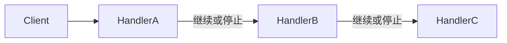

# Rust · 责任链（Chain of Responsibility）

[← Rust 选择指南](README.md) · [Skill 入口](../../SKILL.md) · [可运行源码](../../examples/rust/chain-of-responsibility/main.rs)

**分类：行为型** · **代码目标：Rust 1.70 / edition 2021**

> 让请求沿一组处理者传递，由每个处理者决定处理、继续或拒绝。

模式意图基于参考站概念页归纳；工程取舍与示例为本项目新编。 [概念依据](https://refactoringguru.cn/design-patterns/chain-of-responsibility) · [来源边界](../../docs/SOURCES.md)

## 问题与动机

请求需按顺序进行若干校验；把规则写死在一个大函数里很难重新组合与独立验证。

**本例场景：** 以可组合规则验证整数必须为正且低于上限，失败立即短路。

## 适用与避免

**适用：** 处理顺序可配置，并且停止条件、默认结果与传递语义明确。

**避免：** 必须执行的步骤不允许跳过，却使用可能无人处理的隐式链。

## 结构、参与者与协作

下图是角色关系示意，不是要求每种语言建立相同类层次。动态语言的协议角色可由方法约定承担。



| GoF 角色 | 本例对应职责（成员拼写以代码为准） |
|---|---|
| Handler | Rule：检查当前请求并委派给 next |
| ConcreteHandler | 不同谓词规则或专用处理者 |
| Client | 构建链并提交教学整数请求 |

1. 约定处理者的结果模型：处理完成、继续还是失败。
2. 以固定或可配置顺序组装链，禁止成环。
3. 让未处理请求得到显式结果，不默默丢弃。

## Rust 实现要点

Fn 接口保持规则调用只读，测试计数用单线程 Cell 内部可变性。Box 后继形成所有权链；不能把 Rc/Cell 示例发送到线程中使用。

**实现定位：** 可运行的最小教学实现；语言机制与模式意图分别说明。

## 完整示例

以下代码与独立源码文件逐字同步；无需第三方业务依赖。测试只覆盖代码中实际写出的断言。

```rust
use std::rc::Rc;
use std::cell::Cell;

struct Rule { accepts: Box<dyn Fn(i32) -> bool>, next: Option<Box<Rule>> }
impl Rule {
    fn handle(&self, value: i32) -> bool {
        (self.accepts)(value) && self.next.as_ref().map_or(true, |next| next.handle(value))
    }
}

fn main() {
    let visits = Rc::new(Cell::new(0)); let counter = Rc::clone(&visits);
    let chain = Rule {
        accepts: Box::new(|n| n > 0),
        next: Some(Box::new(Rule { accepts: Box::new(move |n| { counter.set(counter.get() + 1); n < 10 }), next: None })),
    };
    assert!(!chain.handle(-1)); assert_eq!(visits.get(), 0);
    assert!(chain.handle(5)); assert_eq!(visits.get(), 1);
    assert!(!chain.handle(12)); assert_eq!(visits.get(), 2);
    println!("OK chain-of-responsibility");
}
```

## 运行与验证

从仓库根目录执行（先安装对应工具链）：

```sh
cd examples/rust/chain-of-responsibility
rustc --edition=2021 main.rs -o demo
./demo
```

期望标准输出：`OK chain-of-responsibility`。任何内嵌断言失败都应导致非零退出；Python 不要使用 `-O` 禁用断言，Swift 不要使用 `-Ounchecked`。

**当前源码状态：待验证（无匹配当前源码哈希的运行记录）。** [完整验证记录](../../docs/VERIFICATION.md)。源码 SHA-256：`dee4b3cd5be9cdbcf2b7867d0422eaba8979c5aa5cff0eb2409a76fe8bf1c74f`。

## 收益与代价

**收益**

- 发送者与具体处理者解耦。
- 处理步骤可复用、重新排序和单独测试。

**代价**

- 顺序会影响结果，调试需要知道经过哪些节点。
- 传统责任链不保证必有处理者；本例采用短路校验链变体。

## 工程边界与常见错误

生产中记录规则标识与短路原因。安全校验链的顺序不能随意让用户重排；异步中间件还需约定 next 是否只能调用一次。

- 每个节点都无条件执行，仍声称具备短路语义。
- 重复调用 next 或形成循环。
- 拒绝后仍执行后面的副作用。

上述工程要求不是运行一次教学示例便能证明的能力；未特别实现的并发访问、外部 I/O、事务、重试与持久化不在本例保证内。

## 扩展测试建议（不等于已全部实现）

- 合法请求经过所有要求的规则。
- 首条失败规则立即停止。
- 终端成功/无人处理语义明确。

针对你的真实输入补充边界/错误用例，再检查替换实现是否保持契约。必要时加入并发竞争、生命周期释放、深度/内存上限和回归测试；不要把断言通过当成生产就绪认证。

## 与替代模式比较

**[命令](command.md)：** 命令封装一次操作；责任链决定请求经过哪些处理者。

**[装饰](decorator.md)：** 装饰常围绕一次调用叠加行为；链明确控制向后传递与停止。

## 来源与继续阅读

- [模式概念](https://refactoringguru.cn/design-patterns/chain-of-responsibility)
- [Rust Book：trait objects](https://doc.rust-lang.org/book/ch18-02-trait-objects.html)
- [OnceLock](https://doc.rust-lang.org/std/sync/struct.OnceLock.html)
- [来源分层、原创范围与未覆盖项](../../docs/SOURCES.md)
