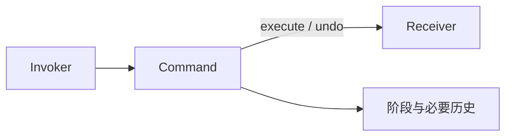

# Rust · 命令（Command）

[← Rust 选择指南](README.md) · [Skill 入口](../../SKILL.md) · [可运行源码](../../examples/rust/command/main.rs)

**分类：行为型** · **代码目标：Rust 1.70 / edition 2021**

> 把一次请求、其接收者与执行所需参数封装为独立对象。

模式意图基于参考站概念页归纳；工程取舍与示例为本项目新编。 [概念依据](https://refactoringguru.cn/design-patterns/command) · [来源边界](../../docs/SOURCES.md)

## 问题与动机

按钮或队列不应知道如何修改计数器，同时系统希望记录与撤销一次操作。

**本例场景：** 封装一次 Counter 增量操作，执行后可撤销；错误调用次序被拒绝。

## 适用与避免

**适用：** 需要排队、历史记录、延迟执行、撤销，或将请求传给通用调用器。

**避免：** 调用没有生命周期、历史或排队需求，一个函数已充分表达意图。

## 结构、参与者与协作

下图是角色关系示意，不是要求每种语言建立相同类层次。动态语言的协议角色可由方法约定承担。



| GoF 角色 | 本例对应职责（成员拼写以代码为准） |
|---|---|
| Command | AddCommand：execute / undo |
| Receiver | Counter：持有被修改值 |
| Invoker | 演示调用代码或历史栈：只使用命令接口 |

1. 把接收者和请求参数保存到命令中。
2. 定义执行成功、重复执行与撤销的规则。
3. 调用器只负责调度或历史，不承接接收者业务逻辑。

## Rust 实现要点

命令持独占可变借用，编译器阻止命令存续期间通过其他普通别名修改接收者；这是与共享引用语言的重要差异。长期多命令历史需重新设计所有权与版本机制。

**实现定位：** 可运行的最小教学实现；语言机制与模式意图分别说明。

## 完整示例

以下代码与独立源码文件逐字同步；无需第三方业务依赖。测试只覆盖代码中实际写出的断言。

```rust
struct Counter { value: i32 }
struct AddCommand<'a> { counter: &'a mut Counter, delta: i32, before: i32, phase: Phase }
#[derive(PartialEq)]
enum Phase { New, Done, Undone }
impl<'a> AddCommand<'a> {
    fn new(counter: &'a mut Counter, delta: i32) -> Self { Self { counter, delta, before: 0, phase: Phase::New } }
    fn value(&self) -> i32 { self.counter.value }
    fn execute(&mut self) -> Result<(), &'static str> {
        if self.phase != Phase::New { return Err("execute once"); }
        let next = self.counter.value.checked_add(self.delta).ok_or("overflow")?;
        self.before = self.counter.value; self.counter.value = next; self.phase = Phase::Done; Ok(())
    }
    fn undo(&mut self) -> Result<(), &'static str> {
        if self.phase != Phase::Done { return Err("nothing to undo"); }
        self.counter.value = self.before; self.phase = Phase::Undone; Ok(())
    }
}

fn main() {
    let mut counter = Counter { value: 0 };
    {
        let mut command = AddCommand::new(&mut counter, 3);
        assert!(command.undo().is_err());
        assert!(command.execute().is_ok()); assert_eq!(command.value(), 3);
        assert!(command.execute().is_err());
        assert!(command.undo().is_ok()); assert_eq!(command.value(), 0);
        assert!(command.undo().is_err());
    }
    assert_eq!(counter.value, 0);
    println!("OK command");
}
```

## 运行与验证

从仓库根目录执行（先安装对应工具链）：

```sh
cd examples/rust/command
rustc --edition=2021 main.rs -o demo
./demo
```

期望标准输出：`OK command`。任何内嵌断言失败都应导致非零退出；Python 不要使用 `-O` 禁用断言，Swift 不要使用 `-Ounchecked`。

**当前源码状态：待验证（无匹配当前源码哈希的运行记录）。** [完整验证记录](../../docs/VERIFICATION.md)。源码 SHA-256：`069c0f9a14ec6263292893db932425e652d1e69b45cc00e7490b7c418ff52e9b`。

## 收益与代价

**收益**

- 请求可作为值被存储与传递。
- 调用器不耦合具体接收者操作。

**代价**

- 撤销不是每个操作都可行。
- 队列化会带来版本、幂等与序列化的独立问题。

## 工程边界与常见错误

本例限制一次 execute/undo，且接收者不被其他操作并发修改。生产历史应使用版本检查、可逆操作或补偿，避免旧快照覆盖后续合法修改。

- 没有成功执行就允许 undo。
- 重放重复扣减等副作用，却没有幂等策略。
- 把内存撤销示例当成生产事务恢复。

上述工程要求不是运行一次教学示例便能证明的能力；未特别实现的并发访问、外部 I/O、事务、重试与持久化不在本例保证内。

## 扩展测试建议（不等于已全部实现）

- 执行使值增加，撤销恢复先前值。
- 重复 execute 或重复 undo 按明确规则拒绝。
- 失败路径不留下伪造的成功历史。

针对你的真实输入补充边界/错误用例，再检查替换实现是否保持契约。必要时加入并发竞争、生命周期释放、深度/内存上限和回归测试；不要把断言通过当成生产就绪认证。

## 与替代模式比较

**[备忘录](memento.md)：** 命令保存做什么；备忘录保存状态，二者可组合支持撤销。

**[策略](strategy.md)：** 命令代表一次请求及其生命周期；策略代表可替换的算法选择。

## 来源与继续阅读

- [模式概念](https://refactoringguru.cn/design-patterns/command)
- [Rust Book：trait objects](https://doc.rust-lang.org/book/ch18-02-trait-objects.html)
- [OnceLock](https://doc.rust-lang.org/std/sync/struct.OnceLock.html)
- [来源分层、原创范围与未覆盖项](../../docs/SOURCES.md)
