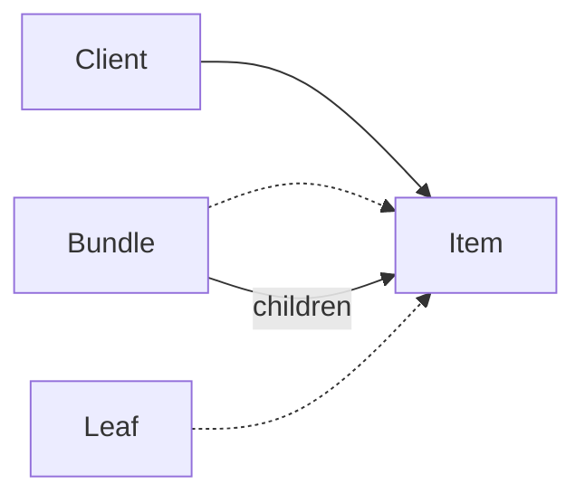

# Rust · 组合（Composite）

[← Rust 选择指南](README.md) · [Skill 入口](../../SKILL.md) · [可运行源码](../../examples/rust/composite/main.rs)

**分类：结构型** · **代码目标：Rust 1.70 / edition 2021**

> 让叶子和由子节点组成的容器遵循同一操作契约，以统一处理树形结构。

模式意图基于参考站概念页归纳；工程取舍与示例为本项目新编。 [概念依据](https://refactoringguru.cn/design-patterns/composite) · [来源边界](../../docs/SOURCES.md)

## 问题与动机

订单可以包含单项与嵌套套餐；客户端不应在每层都区分容器和单项再重复递归。

**本例场景：** 对嵌套 LineItem / Bundle 统一调用 total，计算教学整数值。

## 适用与避免

**适用：** 领域天然是树形的整体—部分结构，叶子与容器存在有意义的共同操作。

**避免：** 结构本质是含环的图，或共同接口必须塞入大量叶子不支持的操作。

## 结构、参与者与协作

下图是角色关系示意，不是要求每种语言建立相同类层次。动态语言的协议角色可由方法约定承担。



| GoF 角色 | 本例对应职责（成员拼写以代码为准） |
|---|---|
| Component | Item：total 操作 |
| Leaf | LineItem：固定数值 |
| Composite | Bundle：持有多个 Item 并汇总 |

1. 提取叶子与容器都合理支持的操作。
2. 容器持有同一 Component 契约的子节点。
3. 从根节点发起操作，由容器递归委派给孩子。

## Rust 实现要点

Box 所有权树避免无约束共享和引用环；dyn Item 支持异构子节点。例中构造测试只用非负小整数，公共 API 仍需校验数值与最大深度。

**实现定位：** 可运行的最小教学实现；语言机制与模式意图分别说明。

## 完整示例

以下代码与独立源码文件逐字同步；无需第三方业务依赖。测试只覆盖代码中实际写出的断言。

```rust
trait Item { fn total(&self) -> i32; }
struct LineItem { price: i32 }
impl Item for LineItem { fn total(&self) -> i32 { self.price } }
struct Bundle { children: Vec<Box<dyn Item>> }
impl Item for Bundle { fn total(&self) -> i32 { self.children.iter().map(|item| item.total()).sum() } }

fn main() {
    let root = Bundle { children: vec![
        Box::new(LineItem { price: 10 }),
        Box::new(Bundle { children: vec![Box::new(LineItem { price: 20 }), Box::new(LineItem { price: 30 })] }),
    ] };
    assert_eq!(root.total(), 60);
    assert_eq!(Bundle { children: vec![] }.total(), 0);
    println!("OK composite");
}
```

## 运行与验证

从仓库根目录执行（先安装对应工具链）：

```sh
cd examples/rust/composite
rustc --edition=2021 main.rs -o demo
./demo
```

期望标准输出：`OK composite`。任何内嵌断言失败都应导致非零退出；Python 不要使用 `-O` 禁用断言，Swift 不要使用 `-Ounchecked`。

**当前源码状态：已通过编译/运行与内嵌断言。** [完整验证记录](../../docs/VERIFICATION.md)。源码 SHA-256：`3f53780b3c4004bc437932dc01508dae44befa34f513ef00defbce6271650737`。

## 收益与代价

**收益**

- 客户端统一处理单个对象与子树。
- 树结构能够组合与局部替换。

**代价**

- 限制子节点类型或维护父引用时更复杂。
- 深树有递归栈成本，图结构需另加环检测。

## 工程边界与常见错误

示例不允许客户端直接修改内部孩子集合，也不宣称处理任意有环图。大规模树应考虑迭代遍历、深度限制或显式栈。

- 让叶子实现无意义的 add/remove。
- 允许把祖先加入子树造成无限递归。
- 共享可变子节点却没有所有权规则。

上述工程要求不是运行一次教学示例便能证明的能力；未特别实现的并发访问、外部 I/O、事务、重试与持久化不在本例保证内。

## 扩展测试建议（不等于已全部实现）

- 嵌套套餐总值等于叶子值之和。
- 空容器得到约定的单位元 0。
- 生产树操作另测深度、环和共享节点策略。

针对你的真实输入补充边界/错误用例，再检查替换实现是否保持契约。必要时加入并发竞争、生命周期释放、深度/内存上限和回归测试；不要把断言通过当成生产就绪认证。

## 与替代模式比较

**[装饰](decorator.md)：** 组合通常有多个孩子并汇聚结果；装饰通常包装一个部件并叠加责任。

**[访问者](visitor.md)：** 组合组织对象树；访问者为稳定的节点类型添加新操作，两者常配合。

## 来源与继续阅读

- [模式概念](https://refactoringguru.cn/design-patterns/composite)
- [Rust Book：trait objects](https://doc.rust-lang.org/book/ch18-02-trait-objects.html)
- [OnceLock](https://doc.rust-lang.org/std/sync/struct.OnceLock.html)
- [来源分层、原创范围与未覆盖项](../../docs/SOURCES.md)
