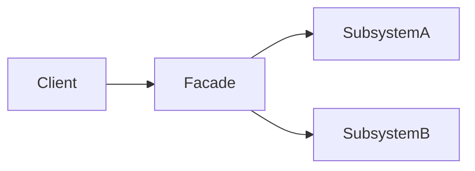

# Rust · 外观（门面）（Facade）

[← Rust 选择指南](README.md) · [Skill 入口](../../SKILL.md) · [可运行源码](../../examples/rust/facade/main.rs)

**分类：结构型** · **代码目标：Rust 1.70 / edition 2021**

> 为一组子系统提供面向用例的简洁入口，降低客户端对内部调用次序的依赖。

模式意图基于参考站概念页归纳；工程取舍与示例为本项目新编。 [概念依据](https://refactoringguru.cn/design-patterns/facade) · [来源边界](../../docs/SOURCES.md)

## 问题与动机

下单流程需要先保留库存再创建收据；让每个调用者了解每一步会使子系统细节扩散。

**本例场景：** Checkout 协调库存与收据两个内存子系统，客户端不编排它们。

## 适用与避免

**适用：** 存在真实的多组件子系统，客户端只需要少数稳定用例。

**避免：** 一个入口不断承接所有业务职责，逐渐形成上帝对象。

## 结构、参与者与协作

下图是角色关系示意，不是要求每种语言建立相同类层次。动态语言的协议角色可由方法约定承担。



| GoF 角色 | 本例对应职责（成员拼写以代码为准） |
|---|---|
| Facade | Checkout：协调 place 操作 |
| Subsystem | Inventory / Receipts：独立子系统 |
| Client | 只依赖 Checkout 的用例接口 |

1. 从客户端用例定义一个小而稳定的入口。
2. 外观委派给子系统，不把所有领域算法搬进自己。
3. 记录执行顺序、失败边界和可绕过外观的高级 API。

## Rust 实现要点

Result 与 ? 保持错误显式传播，外观拥有小型子系统值。真实错误枚举、异步取消、补偿和事务必须额外定义，不由单一入口自动提供。

**实现定位：** 可运行的最小教学实现；语言机制与模式意图分别说明。

## 完整示例

以下代码与独立源码文件逐字同步；无需第三方业务依赖。测试只覆盖代码中实际写出的断言。

```rust
struct Inventory;
impl Inventory {
    fn reserve(&self, quantity: u32) -> Result<String, &'static str> {
        if quantity == 0 { return Err("positive quantity required"); }
        Ok(format!("reserved:{quantity}"))
    }
}
struct Receipts;
impl Receipts { fn create(&self, reservation: &str) -> String { format!("receipt:{reservation}") } }
struct Checkout { inventory: Inventory, receipts: Receipts }
impl Checkout {
    fn place(&self, quantity: u32) -> Result<String, &'static str> {
        let reservation = self.inventory.reserve(quantity)?;
        Ok(self.receipts.create(&reservation))
    }
}

fn main() {
    let checkout = Checkout { inventory: Inventory, receipts: Receipts };
    assert_eq!(checkout.place(2).expect("valid quantity"), "receipt:reserved:2");
    assert!(checkout.place(0).is_err());
    println!("OK facade");
}
```

## 运行与验证

从仓库根目录执行（先安装对应工具链）：

```sh
cd examples/rust/facade
rustc --edition=2021 main.rs -o demo
./demo
```

期望标准输出：`OK facade`。任何内嵌断言失败都应导致非零退出；Python 不要使用 `-O` 禁用断言，Swift 不要使用 `-Ounchecked`。

**当前源码状态：已通过编译/运行与内嵌断言。** [完整验证记录](../../docs/VERIFICATION.md)。源码 SHA-256：`d1234683fc1414509c84610c5cd03853727e41f51425375deca2f75c63e70825`。

## 收益与代价

**收益**

- 客户端减少对子系统细节的依赖。
- 子系统演进可在边界内消化。

**代价**

- 外观容易变成不受控的职责集中点。
- 统一入口不会自动提供事务或回滚。

## 工程边界与常见错误

示例是内存流程，不包含真实支付。跨服务步骤需要额外的幂等、补偿或事务设计；不要把 Facade 名字作为一致性保证。

- 认为外观必须禁止任何直接访问子系统。
- 把异常统一吞掉并假装成功。
- 把调用两项服务等同于分布式事务。

上述工程要求不是运行一次教学示例便能证明的能力；未特别实现的并发访问、外部 I/O、事务、重试与持久化不在本例保证内。

## 扩展测试建议（不等于已全部实现）

- 成功用例按预期顺序保留库存并生成收据。
- 失败路径不能返回虚假的成功结果。
- 外观替身与真实子系统契约保持一致。

针对你的真实输入补充边界/错误用例，再检查替换实现是否保持契约。必要时加入并发竞争、生命周期释放、深度/内存上限和回归测试；不要把断言通过当成生产就绪认证。

## 与替代模式比较

**[适配器](adapter.md)：** 外观简化复杂度；适配器解决不兼容。

**[中介者](mediator.md)：** 外观通常单向为客户端服务；中介者管理同事对象之间的协作规则。

## 来源与继续阅读

- [模式概念](https://refactoringguru.cn/design-patterns/facade)
- [Rust Book：trait objects](https://doc.rust-lang.org/book/ch18-02-trait-objects.html)
- [OnceLock](https://doc.rust-lang.org/std/sync/struct.OnceLock.html)
- [来源分层、原创范围与未覆盖项](../../docs/SOURCES.md)
