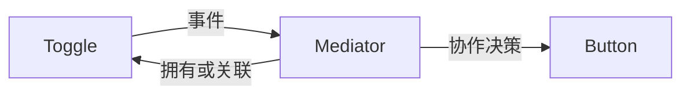

# Rust · 中介者（Mediator）

[← Rust 选择指南](README.md) · [Skill 入口](../../SKILL.md) · [可运行源码](../../examples/rust/mediator/main.rs)

**分类：行为型** · **代码目标：Rust 1.70 / edition 2021**

> 把一组同事对象之间的交互规则集中到协作对象中，避免同事彼此形成网状依赖。

模式意图基于参考站概念页归纳；工程取舍与示例为本项目新编。 [概念依据](https://refactoringguru.cn/design-patterns/mediator) · [来源边界](../../docs/SOURCES.md)

## 问题与动机

表单中的选项改变需要影响提交按钮；让每个控件直接引用其他控件会使规则难以管理。

**本例场景：** Dialog 接收 Toggle 变化并更新 SubmitButton，控件互不引用。

## 适用与避免

**适用：** 多个组件有明确的一组协作规则，需要减少组件间相互引用。

**避免：** 只有简单广播，没有集中决策；或者中介者膨胀到管理整个系统。

## 结构、参与者与协作

下图是角色关系示意，不是要求每种语言建立相同类层次。动态语言的协议角色可由方法约定承担。



| GoF 角色 | 本例对应职责（成员拼写以代码为准） |
|---|---|
| Mediator | Dialog：决定选项与按钮的协作规则 |
| Colleague | Toggle / SubmitButton：只依赖中介事件或自己的职责 |

1. 列出同事间的业务交互，而不是泛化所有通信。
2. 让同事向中介者报告事件，由中介者决定影响谁。
3. 把中介者限制在一个用例或子系统边界。

## Rust 实现要点

控件返回类型化事件，由拥有控件的中介者处理；避免为了套回调图引入 Rc<RefCell> 环。此事件值方案保留协调意图，非类继承/反向引用的逐字移植。

**实现定位：** 可运行的最小教学实现；语言机制与模式意图分别说明。

## 完整示例

以下代码与独立源码文件逐字同步；无需第三方业务依赖。测试只覆盖代码中实际写出的断言。

```rust
enum UiEvent { Toggled(bool) }
#[derive(Default)]
struct Toggle { checked: bool }
impl Toggle {
    fn set(&mut self, value: bool) -> UiEvent { self.checked = value; UiEvent::Toggled(value) }
}
#[derive(Default)]
struct SubmitButton { enabled: bool }
#[derive(Default)]
struct Dialog { toggle: Toggle, submit: SubmitButton }
impl Dialog {
    fn set_checked(&mut self, value: bool) {
        let event = self.toggle.set(value);
        self.handle(event);
    }
    fn handle(&mut self, event: UiEvent) {
        match event { UiEvent::Toggled(value) => self.submit.enabled = value }
    }
}

fn main() {
    let mut dialog = Dialog::default(); assert!(!dialog.submit.enabled);
    dialog.set_checked(true); assert!(dialog.submit.enabled && dialog.toggle.checked);
    dialog.set_checked(false); assert!(!dialog.submit.enabled);
    println!("OK mediator");
}
```

## 运行与验证

从仓库根目录执行（先安装对应工具链）：

```sh
cd examples/rust/mediator
rustc --edition=2021 main.rs -o demo
./demo
```

期望标准输出：`OK mediator`。任何内嵌断言失败都应导致非零退出；Python 不要使用 `-O` 禁用断言，Swift 不要使用 `-Ounchecked`。

**当前源码状态：待验证（无匹配当前源码哈希的运行记录）。** [完整验证记录](../../docs/VERIFICATION.md)。源码 SHA-256：`410ad58d44665b7326c73d54de983279ccbb768ca7c01142ba4e057543f46455`。

## 收益与代价

**收益**

- 组件可复用，不直接依赖其他同事。
- 交互规则集中，便于场景测试。

**代价**

- 中介者可能成为上帝对象。
- 循环事件与隐含顺序会使行为复杂。

## 工程边界与常见错误

UI 回调应在明确执行上下文中触发。闭包和双向持有可能形成保留环；中介者生命周期要与同事一起管理，而不是永久驻留。

- 控件仍直接操作彼此，中介者只是空转发。
- 所有领域逻辑都放进一个全局 EventBus。
- 双向通知形成反馈循环。

上述工程要求不是运行一次教学示例便能证明的能力；未特别实现的并发访问、外部 I/O、事务、重试与持久化不在本例保证内。

## 扩展测试建议（不等于已全部实现）

- 选择变化后提交按钮状态由中介规则更新。
- 同事对象不直接持有其他同事。
- 反向事件不会造成无限反馈。

针对你的真实输入补充边界/错误用例，再检查替换实现是否保持契约。必要时加入并发竞争、生命周期释放、深度/内存上限和回归测试；不要把断言通过当成生产就绪认证。

## 与替代模式比较

**[观察者](observer.md)：** 观察者广播变化；中介者对协作做决策，可在内部使用观察者。

**[外观（门面）](facade.md)：** 外观为外部客户端简化子系统；中介者组织内部同事交互。

## 来源与继续阅读

- [模式概念](https://refactoringguru.cn/design-patterns/mediator)
- [Rust Book：trait objects](https://doc.rust-lang.org/book/ch18-02-trait-objects.html)
- [OnceLock](https://doc.rust-lang.org/std/sync/struct.OnceLock.html)
- [来源分层、原创范围与未覆盖项](../../docs/SOURCES.md)
