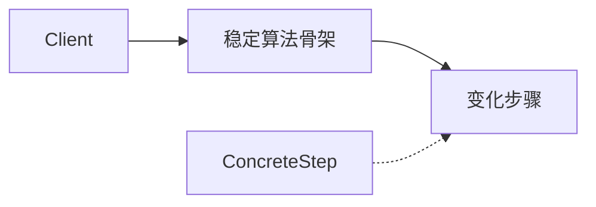

# Rust · 模板方法（Template Method）

[← Rust 选择指南](README.md) · [Skill 入口](../../SKILL.md) · [可运行源码](../../examples/rust/template-method/main.rs)

**分类：行为型** · **代码目标：Rust 1.70 / edition 2021**

> 固定算法的整体步骤与顺序，只把指定步骤开放为扩展点。

模式意图基于参考站概念页归纳；工程取舍与示例为本项目新编。 [概念依据](https://refactoringguru.cn/design-patterns/template-method) · [来源边界](../../docs/SOURCES.md)

## 问题与动机

导入流程统一包含读取、解析和格式化，但不同格式仅需改变解析步骤。

**本例场景：** Importer 固定 run 骨架，把 parse 交给 UpperImporter，得到带统一包装的输出。

## 适用与避免

**适用：** 流程骨架稳定，已有合理继承/trait 扩展点，部分步骤需要定制。

**避免：** 子类需要随意改变流程顺序，或组合函数比继承更清晰。

## 结构、参与者与协作

下图是角色关系示意，不是要求每种语言建立相同类层次。动态语言的协议角色可由方法约定承担。



| GoF 角色 | 本例对应职责（成员拼写以代码为准） |
|---|---|
| AbstractClass | Importer：run 组织稳定流程 |
| PrimitiveOperation | parse：受控扩展步骤 |
| ConcreteClass | UpperImporter：实现具体解析 |

1. 写出稳定的步骤次序与不变量。
2. 只开放最少的抽象步骤或可选 hook。
3. 在支持的语言中限制对模板主流程的覆写；测试真实流程而非孤立 hook。

## Rust 实现要点

trait 默认方法复用算法骨架而非类继承；实现者可以覆写 run，所以不具有 final 保证。必须锁定流程时用不可覆写的自由函数协调 trait 步骤。

**实现定位：** 无类继承语言的意图适配，不伪称经典继承结构。

## 完整示例

以下代码与独立源码文件逐字同步；无需第三方业务依赖。测试只覆盖代码中实际写出的断言。

```rust
trait Importer {
    fn parse(&self, value: &str) -> String;
    fn run(&self, raw: &str) -> String { format!("<{}>", self.parse(raw.trim())) }
}
struct UpperImporter;
impl Importer for UpperImporter { fn parse(&self, value: &str) -> String { value.to_uppercase() } }

fn main() {
    assert_eq!(UpperImporter.run(" hello "), "<HELLO>");
    assert_eq!(UpperImporter.run("   "), "<>");
    println!("OK template-method");
}
```

## 运行与验证

从仓库根目录执行（先安装对应工具链）：

```sh
cd examples/rust/template-method
rustc --edition=2021 main.rs -o demo
./demo
```

期望标准输出：`OK template-method`。任何内嵌断言失败都应导致非零退出；Python 不要使用 `-O` 禁用断言，Swift 不要使用 `-Ounchecked`。

**当前源码状态：已通过编译/运行与内嵌断言。** [完整验证记录](../../docs/VERIFICATION.md)。源码 SHA-256：`70ff445311712531a7d47110adad0e3acea69daba9a0920caceb9fd0c725fc24`。

## 收益与代价

**收益**

- 不同实现复用同一流程结构。
- 约束扩展者只改变允许变化的步骤。

**代价**

- 基类与子类相互依赖，修改骨架可能影响所有扩展。
- 组合不足时容易出现过多 hook。

## 工程边界与常见错误

Go 通过模板函数+小接口表达，Rust 可用 trait 默认方法；这些是无类继承语言的对应组织方式。Python/JavaScript 中 final 约束主要靠设计约定或静态工具，不是运行时安全边界。

- 每一步都可覆写，实际上没有稳定算法。
- 构造函数调用尚未初始化的子类 hook。
- 把带几个回调的普通函数冒充经典继承形式而不说明变体。

上述工程要求不是运行一次教学示例便能证明的能力；未特别实现的并发访问、外部 I/O、事务、重试与持久化不在本例保证内。

## 扩展测试建议（不等于已全部实现）

- 不同 parse 实现不改变前后处理次序。
- 解析结果被统一格式化。
- 涉及资源时另测异常路径也执行清理。

针对你的真实输入补充边界/错误用例，再检查替换实现是否保持契约。必要时加入并发竞争、生命周期释放、深度/内存上限和回归测试；不要把断言通过当成生产就绪认证。

## 与替代模式比较

**[策略](strategy.md)：** 策略在组合对象间替换算法；模板方法保留骨架并开放特定步骤。

**[工厂方法](factory-method.md)：** 工厂方法可作为模板中的创建步骤，但不是所有模板步骤都创建对象。

## 来源与继续阅读

- [模式概念](https://refactoringguru.cn/design-patterns/template-method)
- [Rust Book：trait objects](https://doc.rust-lang.org/book/ch18-02-trait-objects.html)
- [OnceLock](https://doc.rust-lang.org/std/sync/struct.OnceLock.html)
- [来源分层、原创范围与未覆盖项](../../docs/SOURCES.md)
