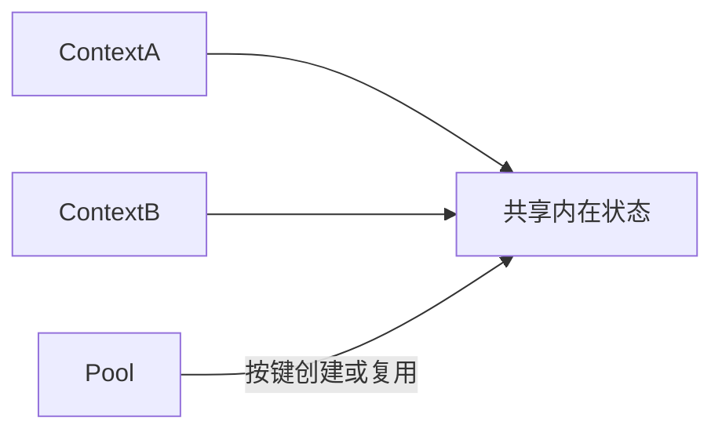

# TypeScript · 享元（Flyweight）

[← TypeScript 选择指南](README.md) · [Skill 入口](../../SKILL.md) · [可运行源码](../../examples/typescript/flyweight/main.ts)

**分类：结构型** · **代码目标：TypeScript 5.x strict / ES2022 / Node.js 18+ 目标**

> 共享大量对象中相同的内在状态，把每次使用特有的外在状态保留在上下文。

模式意图基于参考站概念页归纳；工程取舍与示例为本项目新编。 [概念依据](https://refactoringguru.cn/design-patterns/flyweight) · [来源边界](../../docs/SOURCES.md)

## 问题与动机

成千上万个字形重复存储字体样式，而字符与位置又不能共享。

**本例场景：** 两个位置不同的字形复用同一个字体样式对象。

## 适用与避免

**适用：** 内存测量显示重复、可共享的状态占比高，且共享对象可保持不可变。

**避免：** 对象数量很少、键空间巨大，或共享可变数据带来的同步成本超过节省。

## 结构、参与者与协作

下图是角色关系示意，不是要求每种语言建立相同类层次。动态语言的协议角色可由方法约定承担。



| GoF 角色 | 本例对应职责（成员拼写以代码为准） |
|---|---|
| Flyweight | Style：共享且只读的字体状态 |
| Factory | StylePool：按字体键复用 Style |
| Context | Glyph：字符/位置以及对 Style 的引用 |

1. 区分内在状态与调用上下文。
2. 用完整、规范化的键获取不可变共享对象。
3. 让每个上下文保存独立外在状态，并测量内存收益。

## TypeScript 实现要点

Map 按完整键共享冻结 Style，Glyph 保留位置。此缓存没有容量上限；异步构造时需去重在途 Promise，而不是照搬同步检查/插入。

**实现定位：** 可运行的最小教学实现；语言机制与模式意图分别说明。

## 完整示例

以下代码与独立源码文件逐字同步；无需第三方业务依赖。测试只覆盖代码中实际写出的断言。

```typescript
export {};

function check(condition: boolean, message = "contract failed"): void {
  if (!condition) throw new Error(message);
}
function expectThrows(action: () => unknown): void {
  let failed = false;
  try { action(); } catch { failed = true; }
  check(failed, "expected an error");
}

class Style {
  constructor(readonly font: string) { Object.freeze(this); }
}
class StylePool {
  #styles = new Map<string, Style>();
  get(font: string): Style {
    let style = this.#styles.get(font);
    if (!style) { style = new Style(font); this.#styles.set(font, style); }
    return style;
  }
}
class Glyph {
  constructor(readonly character: string, readonly x: number, readonly style: Style) {}
}

const pool = new StylePool();
const a = new Glyph("a", 0, pool.get("mono"));
const b = new Glyph("b", 10, pool.get("mono"));
check(a.style === b.style);
check(a.x !== b.x);
check(pool.get("serif") !== a.style);
console.log("OK flyweight");
```

## 运行与验证

从仓库根目录执行（先安装对应工具链）：

```sh
cd examples/typescript/flyweight
tsc --strict --target ES2022 --module ES2022 main.ts --outDir .build
node --input-type=module < .build/main.js
```

期望标准输出：`OK flyweight`。任何内嵌断言失败都应导致非零退出；Python 不要使用 `-O` 禁用断言，Swift 不要使用 `-Ounchecked`。

**当前源码状态：已通过编译/运行与内嵌断言。** [完整验证记录](../../docs/VERIFICATION.md)。源码 SHA-256：`a7d59e4cfac9b3f6a1b957ed18f85b9dbfb6fe9540ccd2a1d81783856b704222`。

## 收益与代价

**收益**

- 减少重复内在状态的存储。
- 共享与实例上下文之间有明确边界。

**代价**

- 维护缓存、键和回收策略有额外成本。
- 共享状态可变会引入跨对象污染或锁竞争。

## 工程边界与常见错误

示例池是单线程教学实现。多线程需同步检查与插入，并设容量/弱引用/淘汰策略；Rc/共享指针仅处理生命周期，不自动同步内部状态。

- 把任何缓存都叫享元，却没有内在/外在状态分离。
- 缓存键遗漏属性，错误合并不同对象。
- 无界缓存导致占用持续增长。

上述工程要求不是运行一次教学示例便能证明的能力；未特别实现的并发访问、外部 I/O、事务、重试与持久化不在本例保证内。

## 扩展测试建议（不等于已全部实现）

- 相同字体取得同一共享 Style。
- 不同位置的 Glyph 仍保留各自位置。
- 不同键不会错误地复用同一个样式。

针对你的真实输入补充边界/错误用例，再检查替换实现是否保持契约。必要时加入并发竞争、生命周期释放、深度/内存上限和回归测试；不要把断言通过当成生产就绪认证。

## 与替代模式比较

**[单例](singleton.md)：** 享元按键共享多个实例；单例通常控制一个类型在作用域内的实例。

**[原型](prototype.md)：** 享元共享对象；原型复制对象并按策略隔离状态。

## 来源与继续阅读

- [模式概念](https://refactoringguru.cn/design-patterns/flyweight)
- [TypeScript classes](https://www.typescriptlang.org/docs/handbook/2/classes.html)
- [JavaScript 迭代协议](https://developer.mozilla.org/en-US/docs/Web/JavaScript/Reference/Iteration_protocols)
- [来源分层、原创范围与未覆盖项](../../docs/SOURCES.md)
